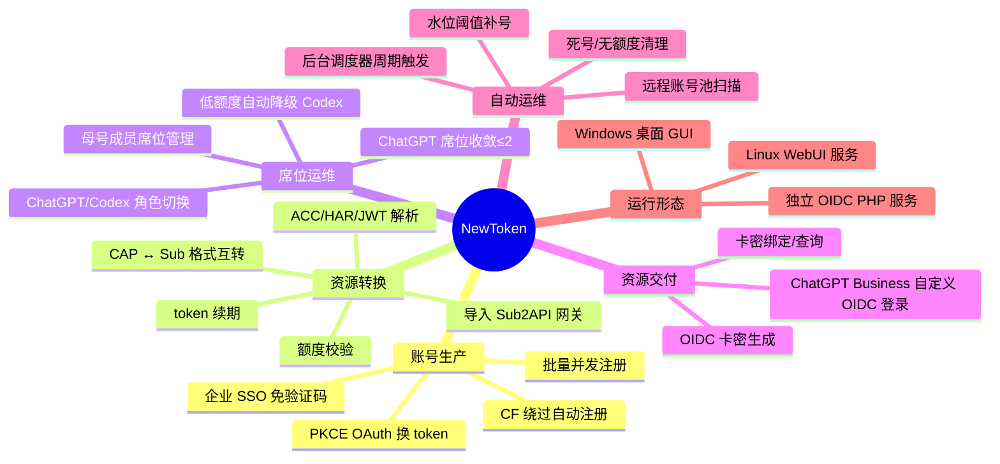
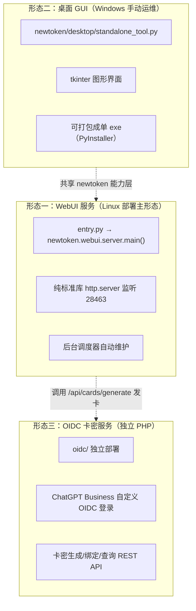
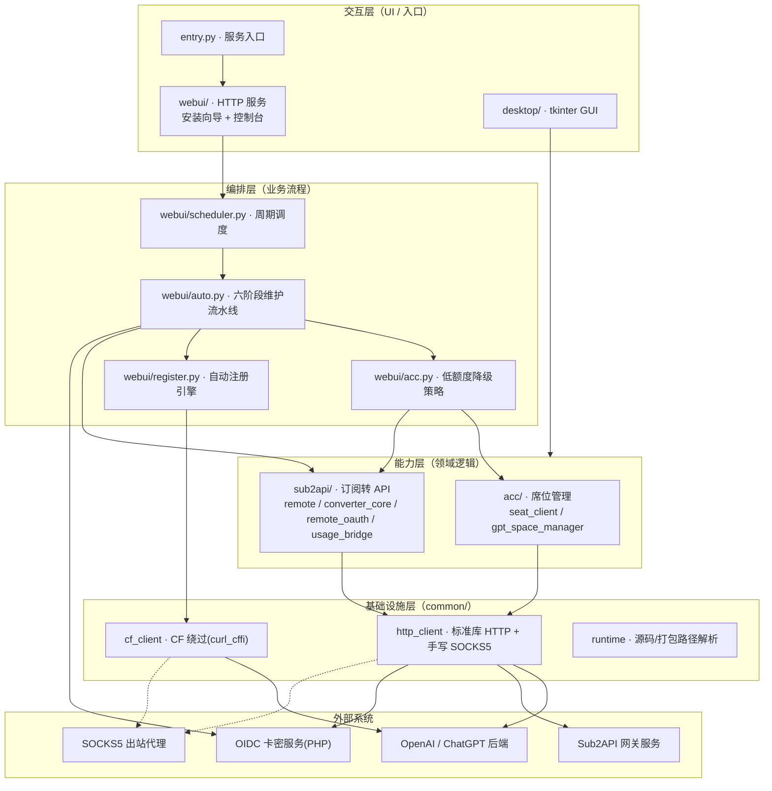
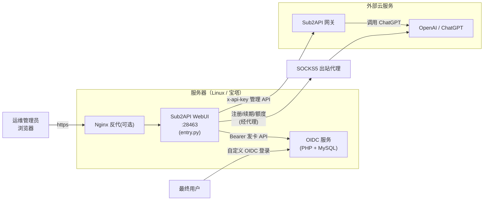
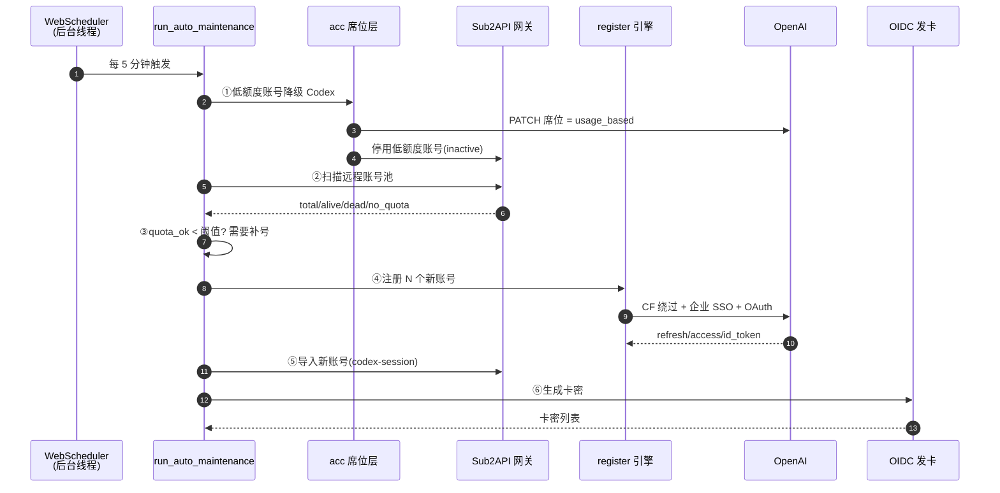

# 01 · 架构总览

本文从宏观视角说明 NewToken / Sub2API WebUI 的系统定位、整体架构、模块划分、技术选型与部署拓扑。读完本篇即可建立对项目的全局认知，再深入后续模块详解。

---

## 1. 系统定位

NewToken 是一套 **ChatGPT 账号资源的自动化生产与运营系统**。它解决的核心问题是：

> 如何用一个 ChatGPT Business/Team **母号**，持续、自动、无人值守地产出一批"可用的 ChatGPT API 资源"，并把这些资源以受控方式（卡密）交付给下游使用者，同时自动淘汰额度耗尽的账号、维持资源池水位。

它不是一个面向终端用户的聊天产品，而是一个**面向资源运营方的中台/工厂系统**。

---

## 2. 功能全景



---

## 3. 三大可执行形态

本项目实际包含三个可独立运行的程序，共享 `newtoken/` 下的能力层代码（OIDC 除外）：



| 形态 | 入口 | 技术 | 适用场景 | 是否含自动维护 |
|------|------|------|----------|----------------|
| **WebUI 服务** | `entry.py` | Python 标准库 `http.server` | Linux / 宝塔面板服务器部署 | ✅ 后台调度器 |
| **桌面 GUI** | `desktop/standalone_tool.py` | tkinter | Windows 本地手动运维、调试 | ❌ 手动触发 |
| **OIDC 服务** | `oidc/public/index.php` | PHP + MySQL | 卡密登录与发放，独立部署 | —（被动 API） |

WebUI 与桌面 GUI **共用** `newtoken/{common,acc,sub2api}` 三个能力层包，区别只在最上层的交互层（`webui/` vs `desktop/`）。OIDC 是完全独立的 PHP 子系统，仅通过 HTTP API 与 WebUI 对接。

---

## 4. 整体分层架构

项目代码遵循清晰的分层：**交互层 → 编排层 → 能力层 → 基础设施层**。



**分层职责：**

- **基础设施层 `common/`**：与业务无关的传输能力。`http_client` 提供零依赖 HTTP（内置手写 SOCKS5）；`cf_client` 提供基于 `curl_cffi` 的 CloudFlare 绕过；`runtime` 解决源码/打包两种模式下的路径定位。
- **能力层 `acc/` + `sub2api/`**：领域逻辑。`acc` 管理 ChatGPT 母号下的成员席位；`sub2api` 负责与 Sub2API 网关交互、token 转换、OAuth 建号、额度桥接。这层是纯函数式的 SDK，不含 UI、不含调度。
- **编排层 `webui/` 中的流程文件**：把能力层组合成完整业务流程。`scheduler` 定时触发 → `auto` 执行六阶段流水线 → 调用 `acc.py`（降级）、`register.py`（注册）、`sub2api`（扫描/导入）、`oidc_client`（发卡）。
- **交互层**：`webui/`（HTTP）与 `desktop/`（GUI）两套人机界面。

---

## 5. 模块划分与职责

`newtoken/` 包内五个子包 + 顶层入口 + 辅助目录：

| 包 / 目录 | 文件数 | 行数(约) | 职责 | 关键文件 |
|-----------|--------|---------|------|----------|
| `newtoken/common/` | 3 | ~690 | 传输基础设施 | `cf_client.py`、`http_client.py`、`runtime.py` |
| `newtoken/acc/` | 4 | ~1330 | 席位与账号管理 | `seat_client.py`(781)、`gpt_space_manager.py`、`cache.py`、`local_env.py` |
| `newtoken/sub2api/` | 5 | ~3460 | 订阅转 API、Sub2API 对接 | `remote.py`(1287)、`converter_core.py`(731)、`remote_oauth.py`、`usage_bridge.py` |
| `newtoken/webui/` | 24 | ~5000 | HTTP 服务 + 自动维护编排 + 前端 | `server.py`、`scheduler.py`、`auto.py`、`config.py`、`register.py`(931)、`acc.py`、`api.py` |
| `newtoken/desktop/` | 9 | ~7900 | tkinter 桌面 GUI | `acc_seat_ui.py`(3426)、`remote_ui.py`、`converter_app.py`、`openai_oauth_ui.py` |
| `entry.py` | 1 | 17 | WebUI 服务入口 | — |
| `scripts/` | 1 | — | Windows 启动 bat | `启动Sub2API独立工具.bat` |
| `tools/` | 1 | 171 | PyInstaller 打包脚本 | `build_sub2api_standalone_exe.py` |
| `oidc/` | — | — | 独立 PHP 卡密服务（自带 `docs/`） | `app/*.php` |

> 详细的每文件每函数说明见 [05](./05-模块详解-common基础设施.md) ~ [09](./09-模块详解-desktop桌面端.md)。

---

## 6. 技术选型与设计原则

### 6.1 零第三方依赖（除注册链路）

整个项目的 `requirements.txt` 只有一行：`curl_cffi>=0.7.0`。这是刻意的设计原则：

- **WebUI 服务**：用标准库 `http.server.ThreadingHTTPServer` 实现，不引入 Flask/FastAPI。
- **HTTP 客户端**：`common/http_client.py` 基于标准库 `http.client`，并**手写实现了 SOCKS5 协议子集**（RFC 1928/1929，含用户名密码认证），不依赖 `requests`/`PySocks`。
- **前端**：HTML/CSS/JS 全部内联在 Python 字符串里（`webui/page.py`、`webui/assets.py`），无构建步骤、无前端框架。
- **唯一例外**：`curl_cffi` 仅用于自动注册引擎（`webui/register.py`）和 CF 绕过（`common/cf_client.py`），因为绕过 CloudFlare 必须伪装浏览器 TLS 指纹（JA3/JA4），标准库无法做到。且它是**延迟导入**的——不跑注册功能就不会加载。

**好处**：部署极简（上传即跑，宝塔面板友好）、攻击面小、Python 版本兼容性强。

### 6.2 能力层与交互层分离

`acc/`、`sub2api/`、`common/` 是纯能力层，不依赖任何 UI 框架。`webui/` 和 `desktop/` 两套交互层都复用它们。例如席位管理的全部逻辑在 `acc/seat_client.py`，WebUI 的 `webui/acc.py` 和桌面的 `desktop/acc_seat_ui.py` 都只是它的不同外壳。

### 6.3 源码 / 打包双模式兼容

`common/runtime.py` 通过 `sys.frozen` 判断是否 PyInstaller 打包，统一解析 `.env`、缓存文件的落盘路径——源码模式落在项目根，打包模式落在 exe 旁。这让同一套代码既能 `python entry.py` 跑，也能打包成 exe 双击运行。

### 6.4 HTTP 错误不抛异常

`http_client.request_json` 对 4xx/5xx **不抛异常**，照常返回 `(status_code, body_text, payload)` 三元组，只有网络层错误才抛 `RuntimeError`。这是全项目的统一约定，所有调用方都自行判断 `status_code`。好处是能拿到错误响应体做精细的失败分类（区分 auth_error / quota_error）。

### 6.5 后台优先、浏览器无关

WebUI 的自动维护由**服务端线程**（`WebScheduler`）执行，而非浏览器 JS 轮询触发。浏览器关掉、用户登出都不影响维护循环。前端只是"看板 + 手动触发器"。

---

## 7. 部署拓扑



**部署顺序（来自 `DEPLOY.md` / `oidc/DEPLOY_OIDC.md`）：**

1. 先部署 OIDC 服务（PHP + MySQL），拿到其 `api_key`。
2. 部署 WebUI（上传代码 → `cp .env.example .env` → 宝塔 Python 项目，启动文件 `entry.py`）。
3. 首次访问 `http://IP:28463/` 进入安装向导，填写 Sub2API 地址/密钥、母号 ACC、OIDC 地址/密钥、自动注册域名、出站代理等。
4. 保存后后台调度器自动开始维护循环。

详见 [10-配置与环境变量](./10-配置与环境变量.md)。

---

## 8. 目录结构详解

```text
newtoken/                          ← 仓库根目录
├── entry.py                       WebUI 服务入口（委托 webui.server.main）
├── .env / .env.example            运行配置（环境变量）
├── requirements.txt               仅 curl_cffi
├── README.md / DEPLOY.md / CHANGELOG.md
│
├── newtoken/                      ← Python 包根（注意：嵌套一层同名目录）
│   ├── __init__.py
│   ├── common/                    【基础设施层】
│   │   ├── cf_client.py           CloudFlare 绕过（curl_cffi TLS 指纹）
│   │   ├── http_client.py         标准库 HTTP + 手写 SOCKS5
│   │   └── runtime.py             源码/打包路径解析
│   ├── acc/                       【能力层：席位管理】
│   │   ├── seat_client.py         席位 SDK + 状态机 + CLI（accounts API）
│   │   ├── gpt_space_manager.py   组织成员管理（organizations API）
│   │   ├── cache.py               本地缓存读写
│   │   └── local_env.py           .env 读写 + Mailcow 配置
│   ├── sub2api/                   【能力层：订阅转 API】
│   │   ├── remote.py              Sub2API 管理端对接（扫描/导入主干）
│   │   ├── converter_core.py      token 校验/转换/JWT 解码
│   │   ├── remote_oauth.py        OpenAI OAuth 远程建号
│   │   ├── usage_bridge.py        ACC↔远程 额度/状态桥接
│   │   └── converter_archive.py   压缩包解压辅助
│   ├── webui/                     【编排层 + 交互层：HTTP 服务】
│   │   ├── server.py              http.server 路由与认证
│   │   ├── scheduler.py           后台周期调度器
│   │   ├── auto.py                六阶段自动维护流水线
│   │   ├── tasks.py               后台任务存储（线程池）
│   │   ├── config.py              WebState 配置中枢 + .env 读写
│   │   ├── api.py                 POST /api/* 路由分发
│   │   ├── acc.py                 低额度降级策略编排
│   │   ├── register.py            CF 绕过自动注册引擎 ★
│   │   ├── oauth.py               OAuth 建号编排
│   │   ├── oidc_client.py         调用 OIDC 发卡
│   │   ├── conversion.py / remote.py / monitor.py / actions.py
│   │   ├── server_auth.py / utils.py
│   │   └── page.py / assets*.py   内联前端（HTML/CSS/JS）
│   └── desktop/                   【交互层：tkinter GUI】
│       ├── standalone_tool.py     桌面主入口（打包入口）
│       ├── converter_app.py       主窗口（转换 + 远程管理）
│       ├── remote_ui.py           远程操作 Mixin
│       ├── acc_seat_ui.py         席位管理 GUI（最大文件 3426 行）
│       ├── openai_oauth_ui.py     OAuth 建号 GUI
│       ├── gpt_space_manager_ui.py 组织成员 GUI
│       ├── github_updater.py      GitHub 自动更新
│       └── first_run_setup.py     首次运行配置向导
│
├── scripts/启动Sub2API独立工具.bat  Windows 启动脚本
├── tools/build_sub2api_standalone_exe.py  PyInstaller 打包脚本
└── oidc/                          ← 独立 PHP 卡密服务
    ├── app/*.php                  业务代码
    ├── docs/01~07-*.md            OIDC 自带文档
    └── DEPLOY_OIDC.md / PHP_SETUP.md
```

> ⚠️ **嵌套目录提醒**：所有 Python 业务代码位于 `仓库根/newtoken/newtoken/...`，外层 `newtoken/` 是仓库目录，内层 `newtoken/` 才是 Python 包。导入路径形如 `from newtoken.webui.server import main`。

---

## 9. 组件交互全景

下图展示一次完整运营闭环中各组件如何协作：



每一步的实现细节见 [03-自动维护流水线](./03-自动维护流水线.md)；注册子流程见 [04-自动注册引擎](./04-自动注册引擎.md)。

---

## 10. 数据存储

项目无数据库（OIDC 除外），所有状态落在文件或内存：

| 数据 | 存储位置 | 说明 |
|------|----------|------|
| 运行配置 | `.env`（项目根 / exe 旁） | 全部环境变量，`WebState`/`local_env` 读写 |
| 母号 ACC 凭据 | `.env` 的 `OPENAI_*` 字段 | access/session token、account_id 等 |
| 额度快照缓存 | `.sub2api_usage_cache.json` | 桌面端按 email 缓存额度 |
| 成员列表缓存 | `.acc_member_list_cache.json` | 桌面端 |
| ACC 原文输入缓存 | `.acc_input_cache.txt` | 桌面端粘贴框内容 |
| 会话缓存 | `.chatgpt_session.json` / `.session_cache.json` | HAR/session 解析结果 |
| UI 设置 | `.acc_ui_settings_cache.json` | 自动刷新间隔等 |
| 后台任务 | 内存（`WebTaskStore`，上限 80 条） | 进程重启即失 |
| 登录会话 / CSRF | 内存（`WebState.sessions` / `csrf_token`） | 进程重启即失 |
| 卡密 / 用户 | OIDC 的 MySQL | 独立服务 |

各缓存文件的 schema 详见 [06-模块详解-acc席位管理](./06-模块详解-acc席位管理.md) 的 `cache.py` 一节。

---

## 小结

- 项目是"ChatGPT 账号工厂 + 自动运维"系统，三种运行形态（WebUI / 桌面 / OIDC）。
- 分四层：交互层、编排层、能力层、基础设施层；能力层是可复用的纯 SDK。
- 核心设计：零依赖（除注册用 curl_cffi）、后台调度器无人值守、源码/打包双模式。
- 核心业务闭环：降级 → 扫描 → 判阈值 → 注册 → 导入 → 发卡。

下一篇：[02-业务理解与核心概念](./02-业务理解与核心概念.md)。
