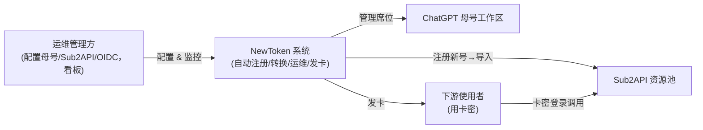
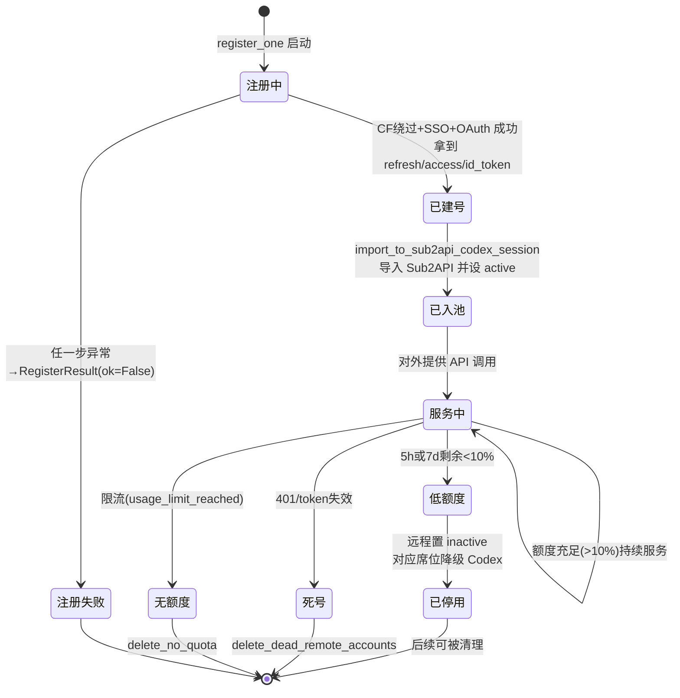
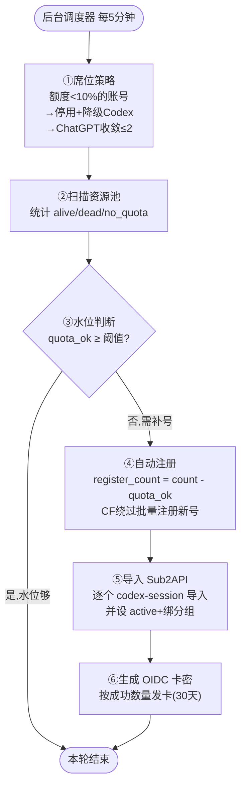
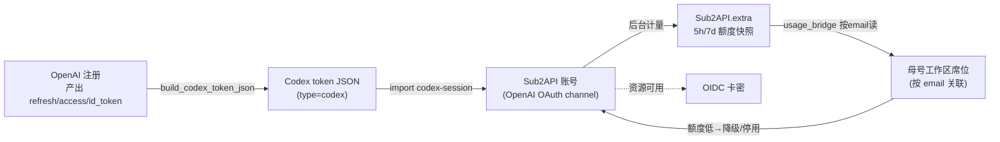

# 02 · 业务理解与核心概念

本文解释项目背后的业务逻辑、关键概念，以及一个账号资源从诞生到淘汰的完整旅程。理解了这些"为什么"，再看代码的"怎么做"会顺畅很多。

---

## 1. 业务背景

ChatGPT 的订阅账号（尤其是 Business/Team 工作区里的 Codex 席位）拥有可观的模型调用额度。如果能：

1. 大量、低成本地获得这类账号；
2. 把账号的登录凭据转换成标准 API token；
3. 汇聚到一个 API 网关（**Sub2API**）统一对外提供服务；
4. 对额度耗尽的账号及时淘汰、补充新号维持水位；
5. 把这些资源以**卡密**形式售卖/分发给下游使用者；

就形成了一条"ChatGPT 算力资源的生产 → 加工 → 仓储 → 零售"的完整链条。本项目就是这条链条的**自动化中台**。

### 痛点与对应方案

| 业务痛点 | 项目中的解决方案 |
|----------|------------------|
| 手动注册 ChatGPT 账号慢、易触发 CloudFlare/风控 | `register.py` 用 curl_cffi 伪装浏览器 TLS 指纹 + Sentinel PoW 求解 + **企业 SSO 域名免验证码**，全自动批量注册 |
| 账号凭据格式杂乱（HAR/JSON/Cookie/JWT） | `acc.py` / `converter_core.py` 统一解析归一化 |
| 账号额度会耗尽，继续调用浪费且暴露 | 低额度阈值（10%）自动**降级 Codex + 停用**，并淘汰死号 |
| 资源池需要持续维持水位 | 后台调度器周期扫描，低于阈值自动补号 |
| 资源交付需要受控、可计费 | OIDC 卡密系统，按需发卡、绑定、查询 |

---

## 2. 核心概念词典

> 这些概念在代码、配置、文档中反复出现，建议先建立准确理解。

### 2.1 母号（Mother Account）

整个系统的**管理身份**。它是一个 ChatGPT Business/Team 工作区的管理员账号。系统用母号的凭据去：

- 列出工作区里的所有成员（席位）；
- 修改成员的席位类型（ChatGPT ↔ Codex）；
- 邀请新成员。

配置项：`ACC_MOTHER_ACCOUNT_EMAIL`（母号邮箱）+ `OPENAI_*`（母号的 access token / session token / account_id 等）。

### 2.2 ACC（凭据原文）

"ACC" 在本项目里指**母号的登录凭据原文**。用户在 WebUI 安装页或桌面端粘贴一段文本，系统自动识别其格式并提取出 access token、account_id 等。支持的格式（见 `webui/acc.py` 的 `parse_acc_import_payload`）：

- 完整 JSON / HAR 抓包文件
- `.env` / `export` 风格片段（`OPENAI_ACCESS_TOKEN=...`）
- 浏览器 Cookie（`__Secure-next-auth.session-token=...`）
- `Bearer xxx` 形式
- 裸 JWT token 字符串

如果只提供了 `sessionToken`，系统会自动调用 OpenAI 的 `/api/auth/session` 用它换取 `accessToken` 和 `accountId`。

### 2.3 席位（Seat）—— 全项目最核心的概念

工作区里每个成员占一个"席位"。本系统里席位**只有两种类型**：

| 展示名 | API 枚举值 | 含义 | 额度特性 |
|--------|-----------|------|----------|
| **ChatGPT** | `default`（也含 `null`/`None`/空） | 标准 ChatGPT 席位 | 占用工作区订阅名额，稀缺 |
| **Codex** | `usage_based` | 按量计费的 Codex 席位 | 可大量存在，是资源池主体 |

> ⚠️ 代码里到处用 `default` 表示 ChatGPT、`usage_based` 表示 Codex。组织接口（`gpt_space_manager`）里 Codex 又写作字符串 `"codex"`——两套 API 用词不同，见 [06](./06-模块详解-acc席位管理.md)。

### 2.4 席位的两条铁律

本系统对席位施加了两条硬性策略（在 `acc/seat_client.py` 的 `enforce_seat_architecture_policy` 实现）：

1. **ChatGPT 席位最多 2 个**（`CHATGPT_SEAT_LIMIT = 2`）。超出会被自动降级为 Codex。
2. **Codex 不能改回 ChatGPT**（单向锁）。`next_seat_type()` 永远返回 Codex；尝试把 Codex 升回 ChatGPT 会直接抛错。

**为什么这样设计？**
- ChatGPT 席位占用宝贵的工作区订阅名额，留 2 个够日常管理用即可。
- 真正用于对外提供 API 服务的是 Codex 席位（按量、可批量），所以系统的运营方向是"把一切都收敛成 Codex"。
- 单向锁避免运维误操作把 Codex 改回 ChatGPT 浪费订阅名额，也简化了状态机（只需向一个方向收敛）。

### 2.5 Sub2API（网关）

一个**第三方 API 网关服务**（不在本仓库内）。它接收一批 ChatGPT 账号凭据（channel），对外暴露成统一的 API 接口。本项目通过它的**管理员 REST API**（鉴权头 `x-api-key`）做：

- 导入账号（`/accounts/import/codex-session`）
- 列出/扫描账号（`/accounts`）
- 批量更新状态（`/accounts/bulk-update`，停用/启用）
- 删除账号、设隐私、刷新 token、查仪表盘统计等

配置项：`SUB2API_BASE_URL` + `SUB2API_ADMIN_API_KEY`。完整 18 个端点见 [11-外部接口对接](./11-外部接口对接.md)。

### 2.6 CAP 格式 vs Sub 格式

账号凭据在系统内有两种 JSON 表示，`converter_core.py` 负责互转：

- **CAP 格式**（Codex 账号记录）：扁平结构，每条含 `{access_token, refresh_token, id_token, account_id, email, type:"codex", expired}`。这是导入 Sub2API 时 `content` 字段里的格式。
- **Sub 格式**（sub2api-data 聚合）：`{type:"sub2api-data", version:1, accounts:[...], proxies:[]}`，每个 account 含完整 `credentials`。这是导出/批量结构。

二者可双向转换：`build_export_account`（CAP→Sub）、`build_cap_account`（Sub→CAP）。

### 2.7 额度窗口（5h / 7d）

ChatGPT/Codex 的额度按两个滚动时间窗计量：

- **5h 窗口**（小时级，`primary_window`）：短期速率限制。
- **7d 窗口**（周级，`secondary_window`）：长期总量限制。

每个窗口都有：剩余百分比、重置时间点、重置剩余秒数。系统取**两窗口剩余百分比的最小值**作为账号的"可用额度"。低于 10% 即判为低额度。

额度数据有两个来源：
- **实时**：`converter_core.fetch_codex_usage` 直接打 OpenAI 的 `wham/usage` 接口（扫描判活时用）。
- **缓存**：`usage_bridge` 读取 Sub2API 后台已缓存的 `extra.codex_5h_used_percent` 等字段（席位展示时用，不打 OpenAI）。

### 2.8 OIDC 卡密

OIDC（`oidc/` 独立 PHP 服务）提供两件事：

1. **ChatGPT Business 自定义 OIDC 登录**：作为身份提供方，让下游用户用卡密登录。
2. **卡密管理**：生成卡密（`/api/cards/generate`）、绑定、查询（`/api/cards/lookup`）。

WebUI 在自动维护的最后一步会调用 OIDC 批量生成卡密（默认 30 天有效期）。配置项：`SUB2API_OIDC_API_URL` + `SUB2API_OIDC_API_KEY`（Bearer 鉴权）。

### 2.9 企业 SSO 注册域名

自动注册能"免验证码"全自动完成的**前提条件**：注册用的邮箱域名（`SUB2API_AUTO_REGISTER_DOMAIN`，代码默认 `@team.edu.sixoner.com`）必须是一个**已在 OpenAI 配置了企业 SSO（Enterprise Connection）的域名**。

这样注册时 OpenAI 会走 SSO 自动批准流（同意页表单自动提交），而不是普通的"邮箱 + 验证码"路径。整个注册过程**不收任何邮件、不需要验证码**。详见 [04-自动注册引擎](./04-自动注册引擎.md)。

---

## 3. 业务角色

---

## 4. 单个账号资源的生命周期

一个 ChatGPT 账号从诞生到淘汰，会经历下面的旅程：

**各阶段对应的代码：**

| 阶段 | 触发者 | 代码 |
|------|--------|------|
| 注册 | 自动维护 Phase 4 | `webui/register.py::register_batch` |
| 入池 | 自动维护 Phase 5 | `sub2api/remote.py::import_to_sub2api_codex_session` |
| 扫描判活 | 自动维护 Phase 2 | `sub2api/remote.py::scan_remote_accounts` |
| 低额度降级 | 自动维护 Phase 1 | `webui/acc.py::enforce_acc_low_quota_policy` |
| 死号/无额度清理 | 手动或 API | `sub2api/remote.py::delete_dead_remote_accounts` |

---

## 5. 完整业务闭环

把上述概念串起来，系统运营的核心闭环是：

> `quota_ok = alive_count - no_quota_count`（有额度的活号数）。`阈值 = SUB2API_AUTO_REGISTER_THRESHOLD`（默认 1）。`count = SUB2API_AUTO_REGISTER_COUNT`（默认 3）。

详细的每阶段实现、提前返回条件、错误处理见 [03-自动维护流水线](./03-自动维护流水线.md)。

---

## 6. 数据资产流转

一个账号的"凭据数据"在系统中如何流动、变形：

**关键关联键**：ChatGPT 席位（母号工作区里的成员）与 Sub2API 账号之间，唯一可靠的关联是**邮箱（email）**。所以 `usage_bridge` 按 email 建立 `{email → 额度快照}` 的索引，让席位工具能显示每个成员对应的远程额度。

---

## 7. 为什么这些设计是合理的（业务视角）

| 设计 | 业务原因 |
|------|----------|
| 优先用 Codex（usage_based）席位 | Codex 按量计费、可大量存在，适合做规模化资源池；ChatGPT 席位占订阅名额、稀缺 |
| Codex 单向不可回退 | 防止运维误操作浪费订阅名额；简化状态收敛 |
| 低额度即降级+停用（而非删除） | 账号额度会按窗口重置，停用而非删除保留了"复活"的可能；降级 Codex 让它不占 ChatGPT 名额 |
| 注册默认串行（max_workers=1） | 批量并发注册极易触发 OpenAI 风控/封号，串行更安全 |
| 用企业 SSO 域名注册 | 唯一能做到"全自动无人值守、免邮件验证码"的注册路径 |
| 出站走 SOCKS5 代理 | 同 IP 批量操作 ChatGPT 易被关联封禁，代理分散出口 IP |
| 后台调度器而非前端触发 | 运维需要 7×24 无人值守，不能依赖浏览器开着 |

---

## 小结

- 业务本质：ChatGPT 算力资源的"生产-加工-仓储-零售"自动化中台。
- 最核心概念是**席位**：ChatGPT(`default`) 稀缺、Codex(`usage_based`) 是资源池主体；两条铁律是"ChatGPT≤2"和"Codex 单向不可回退"。
- 运营闭环六步：降级 → 扫描 → 判阈值 → 注册 → 导入 → 发卡。
- 账号关联靠 email；额度按 5h/7d 双窗口、取最小剩余、低于 10% 即低额度。

下一篇：[03-自动维护流水线](./03-自动维护流水线.md)。
