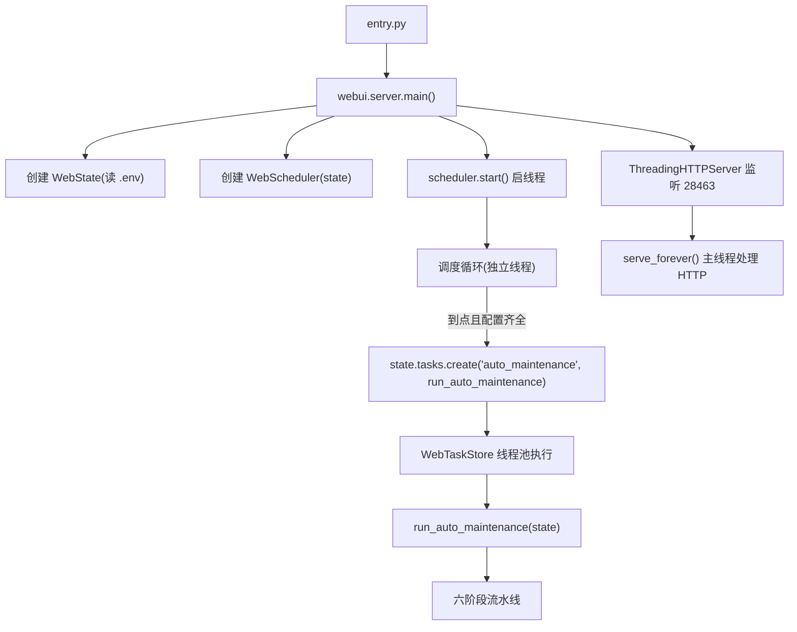
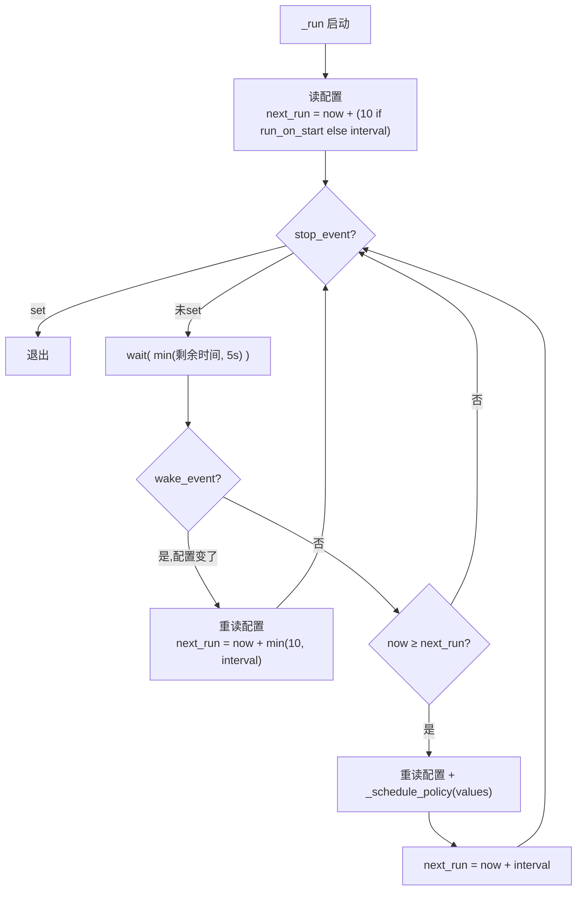
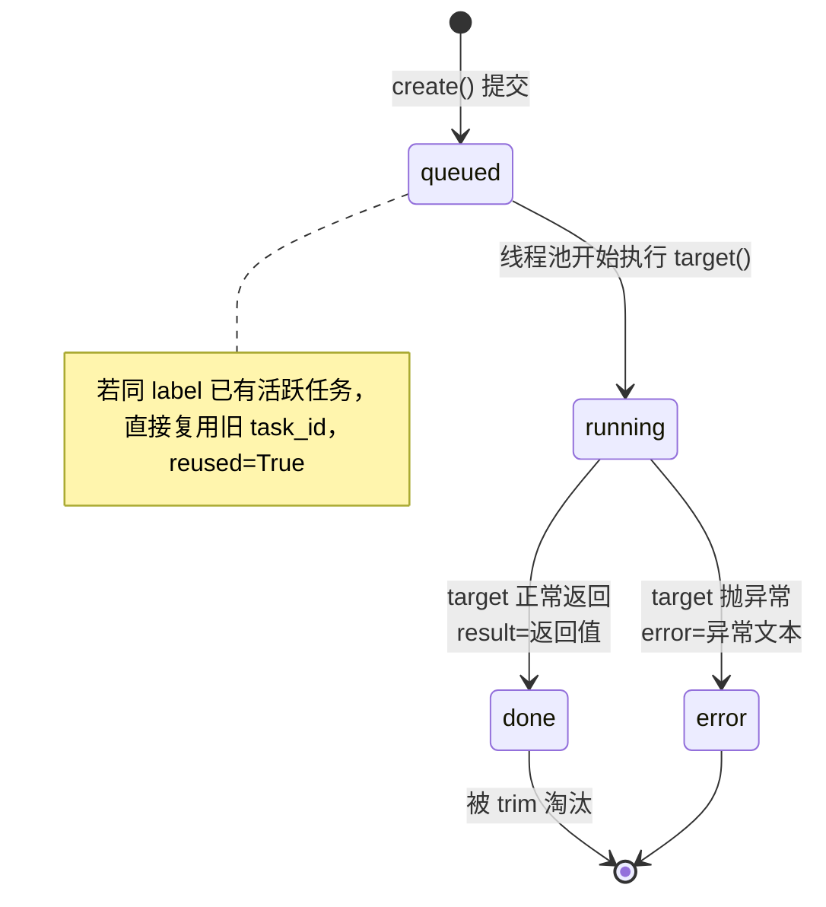
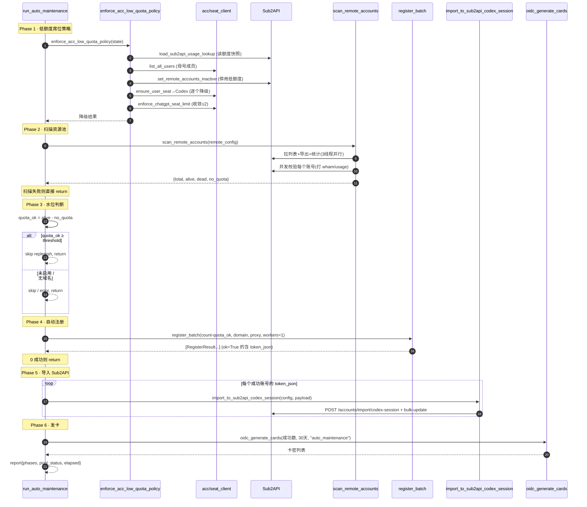
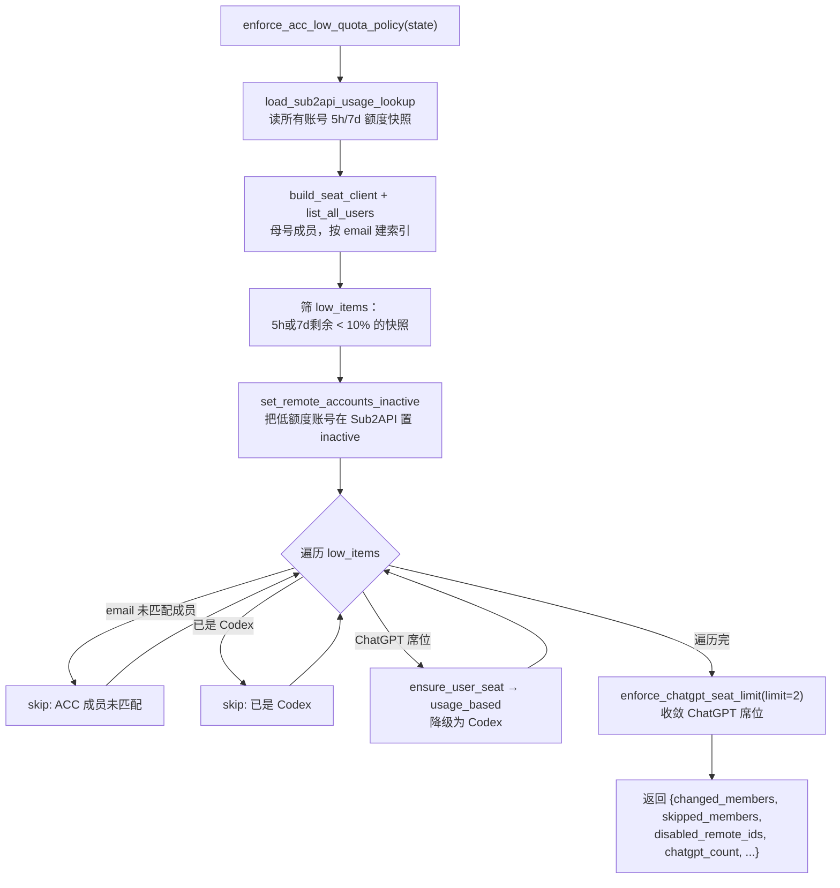

# 03 · 自动维护流水线

这是整个项目的"心脏"。后台调度器周期性地触发一条六阶段流水线，无人值守地完成"降级 → 扫描 → 判阈值 → 注册 → 导入 → 发卡"的完整运营闭环。本文逐步拆解每个环节。

涉及文件：`webui/server.py`、`webui/scheduler.py`、`webui/tasks.py`、`webui/auto.py`、`webui/acc.py`、`webui/config.py`。

---

## 1. 全景：从进程启动到一轮维护



三条线程并存：
- **主线程**：`server.serve_forever()` 处理 HTTP 请求。
- **调度线程**：`WebScheduler._run()` 循环，每到周期提交一个维护任务。
- **任务线程池**：`WebTaskStore` 的 `ThreadPoolExecutor`（最多 4 worker）实际执行 `run_auto_maintenance`。

调度器**只负责"按时提交任务"**，真正的维护逻辑跑在任务线程池里——这样维护耗时不会阻塞调度节拍。

---

## 2. WebScheduler 调度器（`webui/scheduler.py`）

### 2.1 配置读取

调度行为由 3 个环境变量决定，经 `read_policy_scheduler_config` 解析：

| 环境变量 | 默认 | 约束 | 含义 |
|----------|------|------|------|
| `SUB2API_AUTO_POLICY_ENABLED` | `true` | 布尔 | 是否启用自动维护 |
| `SUB2API_AUTO_POLICY_INTERVAL_SECONDS` | `300` | 60 ~ 86400 | 维护周期（秒） |
| `SUB2API_AUTO_POLICY_RUN_ON_START` | `true` | 布尔 | 启动后是否尽快先跑一次 |

两个内置常量：`STARTUP_DELAY_SECONDS = 10`（启动后延迟 10 秒首跑）、`WAKE_CHECK_SECONDS = 5`（循环每 5 秒醒来检查一次停止/唤醒信号）。

### 2.2 调度状态快照

`WebScheduler._status` 是一个被 `/api/tasks/list` 读取、展示在前端"自动维护"看板的状态字典：

```python
{
  "running": bool,            # 调度线程是否在跑
  "enabled": bool,           # 当前是否启用
  "interval_seconds": int,   # 当前周期
  "run_on_start": bool,
  "next_run_at": float|None, # 下次触发的时间戳
  "last_tick_at": float|None,# 上次检查时间
  "last_task_id": str,       # 上次提交的任务 id
  "last_error": str,         # 上次错误
  "skipped_reason": str,     # 跳过原因（如"等待配置：..."）
}
```

### 2.3 调度主循环 `_run()`



要点：
- **wake 机制**：保存配置后（`/api/config/save`）会调 `scheduler.wake()` 设置 `wake_event`，循环立即重读配置并把下次触发拉近到 10 秒内——让新周期/开关即时生效，不用等下一个周期。
- **细粒度等待**：`wait(min(剩余, 5s))` 让线程最多睡 5 秒就醒一次，保证 stop/wake 信号能快速响应（优雅停机 join 超时 5 秒）。
- **enabled=false**：仍走循环，但只更新 `skipped_reason="自动策略已关闭"`，不提交任务。

### 2.4 提交前的配置校验 `find_missing_policy_config`

`_schedule_policy` 在提交任务前先检查配置是否齐全，缺失则跳过并在看板显示"等待配置：xxx"：

1. 若 `is_setup_complete` 为假 → 返回安装向导缺失项（见 [10](./10-配置与环境变量.md)）。
2. 检查 `SUB2API_BASE_URL`、`SUB2API_ADMIN_API_KEY`、`OPENAI_ACCOUNT_ID` 是否有效。
3. 检查 `OPENAI_ACCESS_TOKEN` 或 `OPENAI_SESSION_TOKEN` 至少有一个。

只有全部通过才会 `state.tasks.create(AUTO_MAINTENANCE_TASK_LABEL, run_auto_maintenance, state)` 提交任务，并把返回的 task_id 记入 `last_task_id`。

---

## 3. WebTaskStore 任务模型（`webui/tasks.py`）

所有后台动作（自动维护、远程扫描、删除、转换、导入…）都通过 `WebTaskStore` 异步执行。

### 3.1 核心机制

- **线程池**：`ThreadPoolExecutor(max_workers=4)`（`MAX_WEB_TASK_WORKERS=4`）。
- **同名复用（去重）**：`create(label, ...)` 时若已有同 `label` 的活跃任务，**不新建**，直接复用并标记 `reused=True`。这防止"自动维护"被调度器和用户手动点击同时触发两份。`_active_by_label` 字典维护 label → 活跃 task_id。
- **有界存储**：最多保留 80 条（`max_items`），`_trim_locked` 优先淘汰最旧的已完成任务（不删 queued/running）。
- **线程安全**：所有读写 `_tasks` 都加 `threading.Lock`。

### 3.2 任务状态机



任务对象字段：`id`、`label`、`status`、`created_at`、`started_at`、`finished_at`、`result`、`error`、`reused`。

### 3.3 结果摘要

`list_recent()` 给前端的是 `_summarize_task` 提炼后的版本，只挑关键统计字段（`total_count`、`alive_count`、`dead_count`、`no_quota_count`、`chatgpt_count`、`account_created`、`elapsed` 等）+ 把 `errors` 列表转成数量，避免把完整大 result 推给前端。

---

## 4. run_auto_maintenance 六阶段（`webui/auto.py`）

这是流水线本体。函数签名 `run_auto_maintenance(state: WebState) -> dict`，返回一个包含 `phases`、`errors`、`pool_status`、`elapsed` 的报告字典。每个阶段独立 try/except，互不影响（除扫描失败会提前返回）。

### 4.1 前置：读取配置

```python
config = state.load_config()
auto_cfg = _read_auto_register_config(config)   # {enabled, threshold, count}
email_domain = SUB2API_AUTO_REGISTER_DOMAIN 或 CHATGPT_RANDOM_EMAIL_DOMAIN
proxy_url = SUB2API_OUTBOUND_PROXY_URL
```

`_read_auto_register_config` 解析三个自动注册参数（带容错默认）：
- `enabled`：`SUB2API_AUTO_REGISTER_ENABLED`（默认 True）
- `threshold`：`SUB2API_AUTO_REGISTER_THRESHOLD`（默认 1，≥0）
- `count`：`SUB2API_AUTO_REGISTER_COUNT`（默认 3，≥1）

### 4.2 完整时序图



### 4.3 Phase 1 · 低额度席位策略

调用 `enforce_acc_low_quota_policy(state)`（实现在 `webui/acc.py`）。结果记入 `phases[].result`，异常记入 `errors` 但**不中断**后续阶段。详细逻辑见第 5 节。

### 4.4 Phase 2 · 扫描资源池

```python
remote_config = state.build_remote_config()
scan = scan_remote_accounts(remote_config)
state.last_remote_scan = scan          # 存到 WebState 供删除操作复用
```

`scan_remote_accounts` 返回 `total_count / alive_count / dead_count / no_quota_count` 等（详见 [07](./07-模块详解-sub2api对接.md)）。

> ⚠️ **关键**：Phase 2 是唯一会**提前 `return report`** 的失败点——扫描失败意味着拿不到水位数据，无法决策，直接结束本轮。

### 4.5 Phase 3 · 水位判断（三个提前返回）

```python
alive = scan["alive_count"]
quota_ok = alive - scan["no_quota_count"]   # 有额度的活号数
report["pool_status"] = {alive, quota_ok, threshold}
```

三个提前返回分支（都不算错误，正常结束）：

| 条件 | 行为 |
|------|------|
| `quota_ok >= threshold` | 水位够，跳过补号（`replenish skipped`） |
| `auto_cfg.enabled == False` | 自动注册关闭，跳过 |
| `email_domain` 为空 | 无注册域名，记 error 并返回 |

### 4.6 Phase 4 · 自动注册

```python
register_count = max(1, auto_cfg["count"] - quota_ok)   # 缺多少补多少，至少1个
register_results = register_batch(register_count, email_domain=..., proxy_url=..., max_workers=1)
ok_results = [r for r in register_results if r.ok]
```

- 注册数量是"目标水位 - 当前有额度数"。
- `max_workers=1`：**串行注册**（反风控）。
- 若 `ok_results` 为空（0 个成功），记 error 并返回。

注册引擎细节见 [04-自动注册引擎](./04-自动注册引擎.md)。

### 4.7 Phase 5 · 导入 Sub2API

```python
import_payloads = [r.token_json for r in ok_results if r.token_json]
for payload in import_payloads:
    try:
        import_to_sub2api_codex_session(remote_config, payload)
        imported += 1
    except Exception as exc:
        # 单个失败不中断，记入 phases
```

逐个导入，**单个失败不影响其他**。导入后 Sub2API 端会把账号设为 active、绑定 cc 分组、开启 OpenAI 直通。

### 4.8 Phase 6 · 生成 OIDC 卡密

```python
cards_needed = max(1, len(ok_results))
cards_result = oidc_generate_cards(cards_needed, AUTO_CARD_DAYS, "auto_maintenance", config=config)
```

- `AUTO_CARD_DAYS = 30`：卡密默认 30 天有效期。
- 按成功注册的账号数发等量卡密，备注 `auto_maintenance`。
- OIDC 未配置时返回 `{ok:False}`，记为 skipped，不报错。

### 4.9 返回报告结构

```python
{
  "started_at": "2026-...Z",
  "phases": [
    {"phase":"seat_policy", "elapsed":..., "result":{...}},
    {"phase":"remote_scan", "elapsed":..., "result":{total,alive,dead,no_quota}},
    {"phase":"replenish"/"register"/"import"/"oidc_cards", ...},
  ],
  "errors": ["seat_policy: ...", ...],
  "pool_status": {"alive":.., "quota_ok":.., "threshold":..},
  "elapsed": 12.34,
}
```

前端把 `phases` 渲染成 `phase:ok / skip / err` 的序列条，一眼看清每轮维护各阶段状态。

---

## 5. 低额度降级策略深入（`enforce_acc_low_quota_policy`）

这是 Phase 1 的实现，也是"席位运维"的核心。



关键点：

- **低额度判定** `is_low_quota_snapshot`：5h 或 7d **任一**已知剩余百分比 `< LOW_QUOTA_THRESHOLD_PERCENT(10.0)` 即为低额度。
- **先停用、再降级**：先在 Sub2API 把低额度账号 `inactive`（停止被调用），再把对应席位降级 Codex。
- **降级用 `ensure_user_seat`**：内部带重试（PATCH 席位后翻页复查，遇 400/403 视为可重试），见 [06](./06-模块详解-acc席位管理.md)。
- **顺带收敛**：最后调 `enforce_chatgpt_seat_limit(limit=2)`，把超过 2 个的 ChatGPT 席位也降级。

---

## 6. 关键参数速查

| 参数 | 默认 | 出处 | 作用 |
|------|------|------|------|
| 维护周期 | 300s | `SUB2API_AUTO_POLICY_INTERVAL_SECONDS` | 多久跑一轮 |
| 启动延迟 | 10s | `STARTUP_DELAY_SECONDS` | 启动后首跑延迟 |
| 唤醒检查 | 5s | `WAKE_CHECK_SECONDS` | 循环醒来粒度 |
| 任务并发 | 4 | `MAX_WEB_TASK_WORKERS` | 后台任务线程数 |
| 任务上限 | 80 | `WebTaskStore.max_items` | 任务历史保留数 |
| 补号阈值 | 1 | `SUB2API_AUTO_REGISTER_THRESHOLD` | 有额度活号 < 此值才补 |
| 目标水位 | 3 | `SUB2API_AUTO_REGISTER_COUNT` | 补到的目标数量 |
| 注册并发 | 1 | `register_batch(max_workers=1)` | 串行注册 |
| 卡密有效期 | 30 天 | `AUTO_CARD_DAYS` | 自动发卡有效期 |
| 低额度阈值 | 10% | `LOW_QUOTA_THRESHOLD_PERCENT` | 降级触发线 |
| ChatGPT 上限 | 2 | `CHATGPT_SEAT_LIMIT` | 席位收敛线 |

---

## 7. 故障与边界情况

| 情况 | 系统行为 |
|------|----------|
| `.env` 必填项缺失 | 调度器跳过提交，看板显示"等待配置：xxx" |
| Phase 1 降级出错 | 记入 errors，继续 Phase 2（不中断） |
| Phase 2 扫描失败 | **提前 return**，本轮结束（拿不到水位无法决策） |
| 水位充足 | Phase 3 跳过补号，正常结束 |
| 注册 0 成功 | 记 error，跳过导入/发卡 |
| 单个导入失败 | 记入 phases，继续导入其余 |
| OIDC 未配置 | Phase 6 记 skipped，不报错 |
| 同时手动+定时触发 | `WebTaskStore` 同 label 复用，只跑一份 |
| 进程重启 | 内存任务历史丢失，调度器重新开始 |

> ⚠️ 注意：当前 `main` 分支由于 `api.py` 的 `run_auto_cycle` 导入错误会导致 WebUI 无法启动，使得上述流水线实际跑不起来。修复方法见 [13-已知问题与维护要点](./13-已知问题与维护要点.md)。

---

## 小结

- 三线程模型：HTTP 主线程 + 调度线程 + 任务线程池，职责分离。
- 调度器只管"按时提交"，支持 wake 即时生效、配置缺失跳过。
- 任务模型支持同名去重、有界存储、状态机。
- 六阶段流水线：降级 → 扫描 → 判阈值 → 注册 → 导入 → 发卡，各阶段独立容错，扫描失败是唯一硬中断点。

下一篇：[04-自动注册引擎](./04-自动注册引擎.md)。
