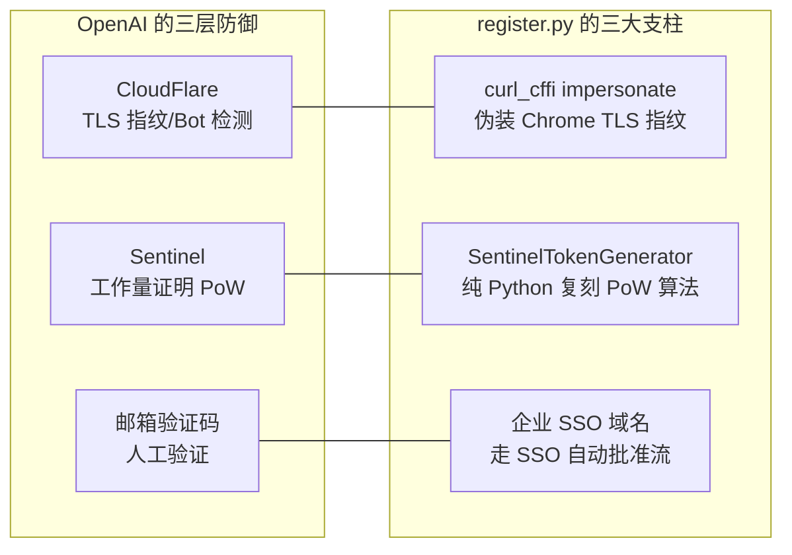
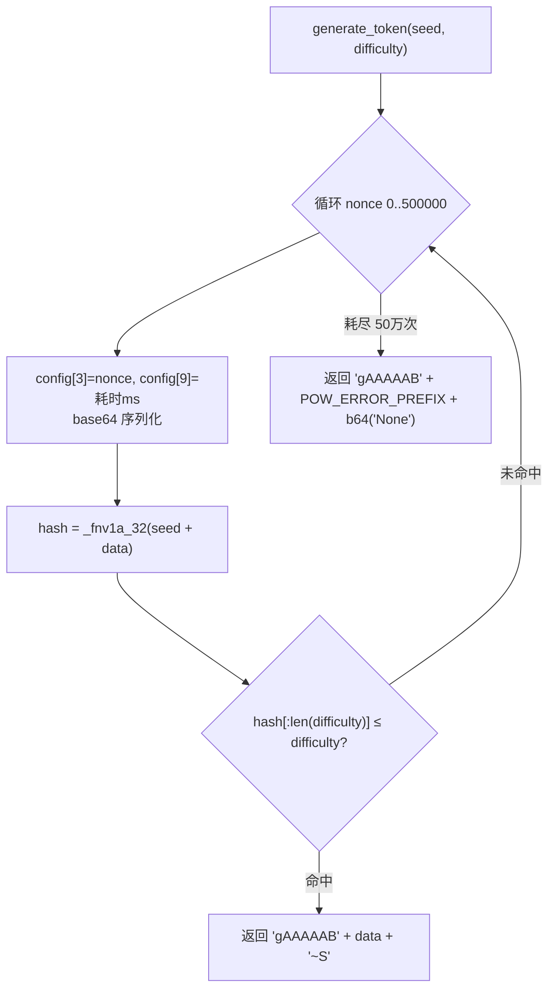
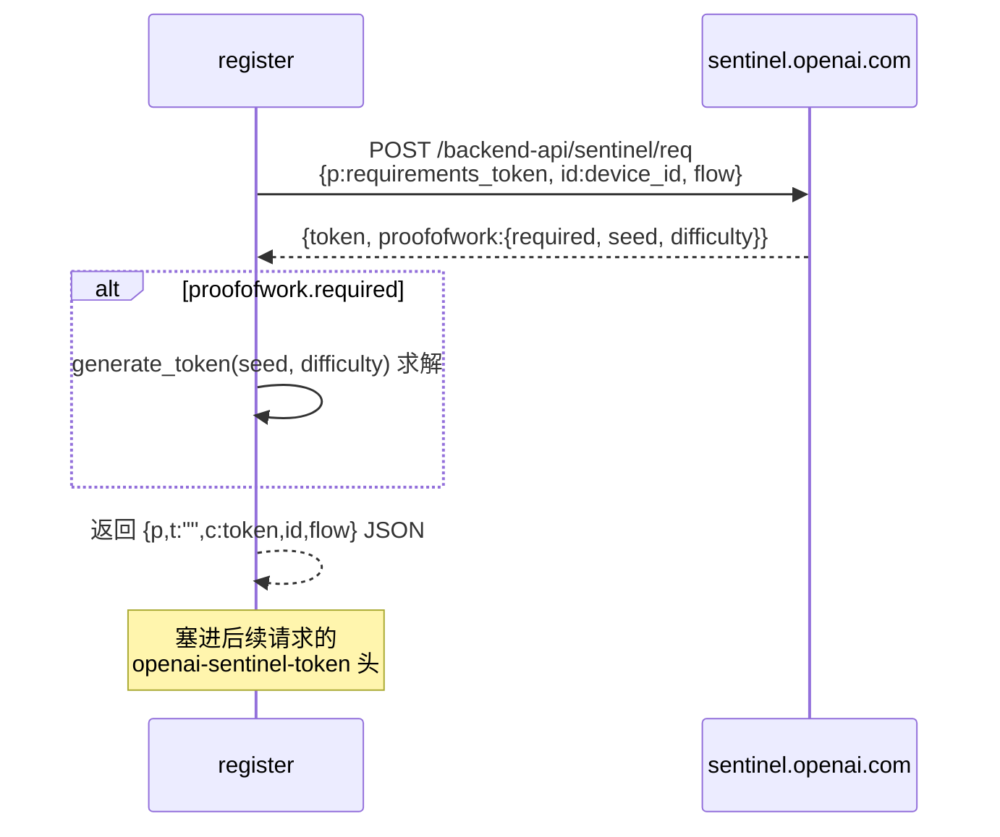
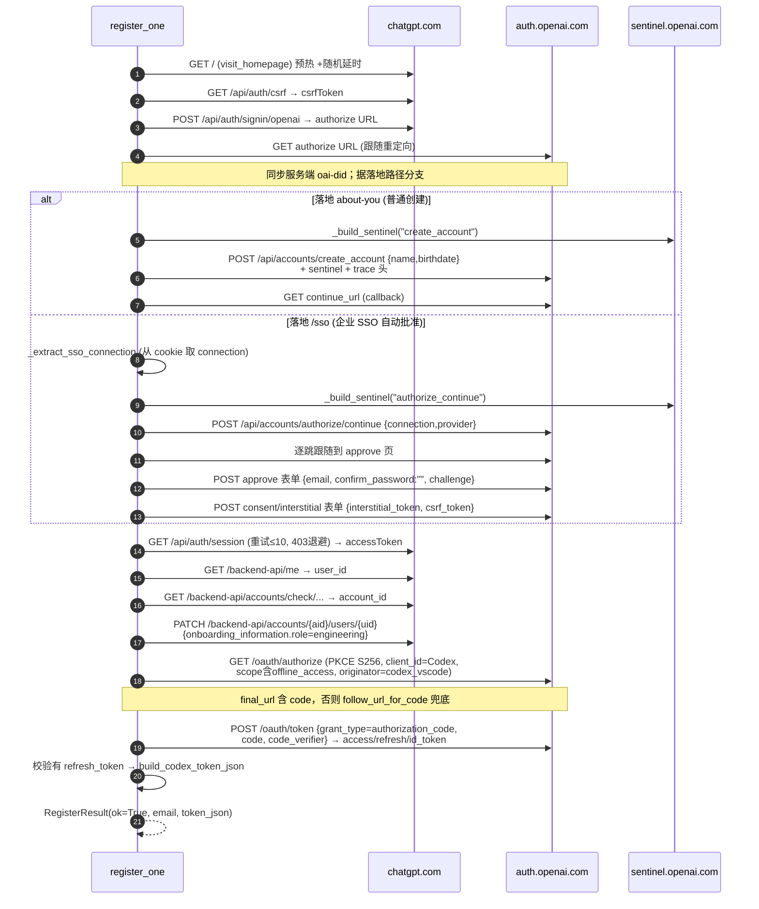
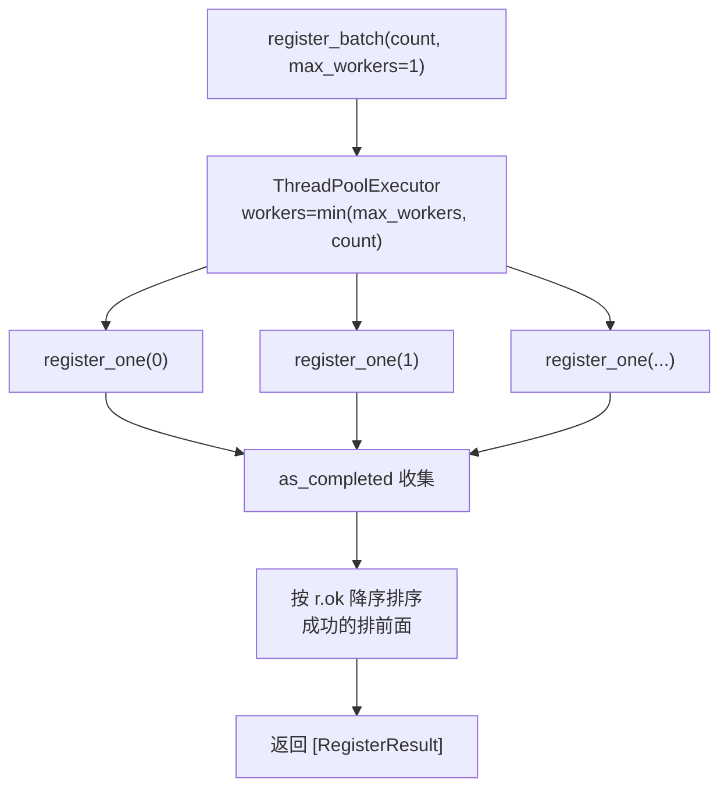

# 04 · 自动注册引擎

> ⚠️ **本文描述的是旧版（`main` 分支）注册流程**——「企业 SSO 免验证码 + `team.edu.sixoner.com`/authentik」。该方案**已废弃**。
> `feat/javoo`（commit `8a65f20`）已将注册链路**重写为：直接 codex oauth + 自建 OIDC 卡密 SSO**：
> 发卡 → codex `auth_url(login_hint)` → 母号 SSO connection（`authorize/continue`）→ OIDC 卡密页**首次激活** → `signin-consent` interstitial → **`POST /api/accounts/workspace/select`**（codex consent）→ callback code → 换 codex token。
> 下文的 **Sentinel PoW、curl_cffi 指纹、PKCE 换 token、反检测技术仍然适用**；变化的只是「如何登录拿到授权 code」——由「企业 SSO 空密码自动放行」改为「OIDC 卡密首次激活」。现行流程与配置以 [14-部署运行手册](./14-部署运行手册.md) 为准。

`webui/register.py` 是项目技术含量最高的部分：它在没有真人操作、不收任何邮件验证码的前提下，自动注册全新的 ChatGPT 账号，并走 Codex 的 OAuth 流程拿到可用 token。本文逐步还原它的每一个环节。

> 被 `webui/auto.py` 的 Phase 4（`register_batch`）调用。

---

## 1. 它要解决的三道难关

自动注册要骗过 OpenAI 的三层防御，对应三大技术支柱：



| 难关 | 对策 | 核心代码 |
|------|------|----------|
| CloudFlare 识别脚本 | curl_cffi 完整伪装 Chrome 的 TLS ClientHello（JA3/JA4）+ HTTP/1.1 降级 | `TeamRegistration.__init__` |
| Sentinel 工作量证明 | 纯 Python 复刻 FNV-1a 哈希 + 浏览器环境数组，真实求解 PoW | `SentinelTokenGenerator` |
| 邮箱验证码 | 用配置了**企业 SSO** 的域名，走自动批准流，绕过验证码 | `_complete_sso_web_flow` / `_complete_external_sso_flow` |

---

## 2. 关键常量

| 常量 | 值 | 含义 |
|------|-----|------|
| `DEFAULT_EMAIL_DOMAIN` | `@team.edu.sixoner.com` | 默认注册邮箱域名（必须是企业 SSO 域名） |
| `AUTH_HOST` | `https://auth.openai.com` | OpenAI 认证域 |
| `CHATGPT_HOST` | `https://chatgpt.com` | ChatGPT 域 |
| `OAUTH_CLIENT_ID` | `app_EMoamEEZ73f0CkXaXp7hrann` | **Codex CLI 的固定 OAuth client_id** |
| `OAUTH_REDIRECT_URI` | `http://localhost:1455/auth/callback` | Codex CLI 本地回调 |
| `OAUTH_SCOPE` | `openid profile email offline_access api.connectors.read api.connectors.invoke` | 含 `offline_access` 才能拿 refresh_token |
| `OAUTH_ORIGINATOR` | `codex_vscode` | 标识来源为 Codex VSCode |
| `SENTINEL_SDK` | `20260124ceb8` | Sentinel SDK 版本号 |
| `MAX_POW_ATTEMPTS` | `500000` | PoW 最大暴力尝试次数 |
| `POW_ERROR_PREFIX` | `wQ8Lk5FbGpA2NcR9dShT6gYjU7VxZ4D` | PoW 失败兜底前缀 |
| `DEFAULT_ONBOARDING_ROLE` | `engineering` | 新号 onboarding 角色 |

随机化资源池：`_SCREEN_SIZES`（5 种分辨率）、`_HARDWARE_CONCURRENCY`（[8,12,16]）、`_FIRST_NAMES`（12 个）、`_LAST_NAMES`（11 个）。

---

## 3. 数据结构

### 3.1 FingerprintProfile（浏览器指纹画像，frozen）

字段：`impersonate`、`user_agent`、`sec_ch_ua`、`accept_language`、`primary_language`、`screen_size`、`hardware_concurrency`。

`_FINGERPRINTS` 列表预置 3 套自洽画像，每个账号开局随机选一套并**全流程锁定**（防止指纹漂移被关联）：

| # | impersonate | UA | 语言 | 屏幕 | 核数 |
|---|-------------|-----|------|------|------|
| 1 | `chrome142` | Win64 Chrome 142 | en-US | 1440x900 | 8 |
| 2 | `chrome131` | Win64 Chrome 131 | en-GB | 1920x1080 | 12 |
| 3 | `chrome` | Chrome 142 | en-US | 1536x864 | 8 |

### 3.2 RegisterResult（单次注册结果，dataclass）

```python
@dataclass
class RegisterResult:
    ok: bool                    # 是否成功
    email: str                  # 注册邮箱（失败时也尽量带）
    token_json: str = ""        # 成功时的 Codex token JSON
    error: str = ""             # 失败原因 "类型: 消息"
    steps_completed: list = ... # 已完成步骤名（诊断卡点用）
```

`auto.py` Phase 4 拿到 `[RegisterResult]` 后，用 `r.ok` 筛成功的，用 `r.token_json` 喂给 Phase 5 导入。

---

## 4. Sentinel PoW 求解器（`SentinelTokenGenerator`）

OpenAI 的 Sentinel 反爬系统会下发工作量证明挑战。本类纯 Python 复刻了浏览器端 SDK 的求解算法。

### 4.1 核心哈希 `_fnv1a_32`

复刻浏览器的 **FNV-1a 32 位哈希 + 三轮位混淆**（乘 16777619、2246822507、3266489909，配合 `>>16`/`>>13` 异或），返回 8 位十六进制。这是 PoW 校验的核心。

### 4.2 浏览器环境数组 `_get_config`

构造一个 21 元素的数组，模仿真实浏览器采集的环境信号：屏幕尺寸、GMT 时间字符串、固定值 `4294705152`、随机数、UA、Sentinel SDK 的 sdk.js URL、语言、`perf_now`、随机 navigator/document 属性名、随机全局对象名、`sid`、硬件并发数、`time_origin` 等。其中大量随机值用于增加真实性。

### 4.3 求解 `generate_token(seed, difficulty)`



- `generate_token`：带难度的**真 PoW 暴力求解**，命中返回 `"gAAAAAB" + result`。
- `generate_requirements_token`：轻量版（`config[3]=1`），无需求解，直接返回 `"gAAAAAC" + b64(config)`，用于初始 requirements 上报。

### 4.4 在请求中的位置 `_build_sentinel(flow)`



PoW 在两个关键步骤被求解并注入 `openai-sentinel-token` 头：`create_account` 和 `authorize/continue`。

---

## 5. TeamRegistration 类（单账号引擎）

### 5.1 初始化（反检测核心）

`__init__(*, proxy_url, tag, email_domain)` 做了：

1. **延迟导入** `curl_cffi`（不跑注册不加载）。
2. 随机选一套 `FingerprintProfile`，锁定全程的 impersonate/UA/sec-ch-ua/语言/屏幕/核数。
3. 创建 `curl_requests.Session(impersonate=指纹型号)`，有代理则设 `proxies`。
4. **强制 `http_version = V1_1`**：HTTP/2 帧指纹更易暴露，降级 HTTP/1.1 更贴近脚本控制。
5. 设置一整套与指纹自洽的请求头（`User-Agent`、`sec-ch-ua`、`sec-ch-ua-platform:"Windows"`、全套 `Sec-Fetch-*`、`Accept-Encoding: gzip,deflate,br` 等）。
6. 预置 cookie `oai-did = device_id`。

### 5.2 注册步骤方法清单

| 方法 | HTTP 请求 | 作用 |
|------|-----------|------|
| `visit_homepage` | GET `chatgpt.com/` | 预热，拿初始 cookie |
| `get_csrf` | GET `chatgpt.com/api/auth/csrf` | 取 csrfToken |
| `signin` | POST `chatgpt.com/api/auth/signin/openai` | 返回 OpenAI authorize URL |
| `authorize` | GET authorize URL（跟随重定向） | 落地，判断分支；同步服务端 `oai-did` |
| `create_account` | POST `auth.openai.com/api/accounts/create_account` | 带 sentinel，创建账号 |
| `callback` | GET continue_url | 账号创建后回调 |
| `_complete_sso_web_flow` | POST `auth.openai.com/api/accounts/authorize/continue` | 企业 SSO 流入口 |
| `_complete_external_sso_flow` | 逐跳重定向 + 表单 POST | SSO 自动批准（核心） |
| `get_access_token` | GET `chatgpt.com/api/auth/session`（重试≤10） | 拿 accessToken |
| `patch_onboarding` | GET /me + GET accounts/check + PATCH users | 完成新号 onboarding |
| `oauth_authorize_codex` | GET `auth.openai.com/oauth/authorize`（PKCE） | 拿授权 code |
| `follow_url_for_code` | 逐跳跟随（≤12） | code 兜底提取 |
| `exchange_codex_code` | POST `auth.openai.com/oauth/token` | 换 token |

### 5.3 模块级 Helper

- `generate_pkce()`：标准 OAuth PKCE S256（`verifier` + `challenge=b64url(sha256(verifier))`）。
- `_make_trace_headers()`：伪造 Datadog RUM 链路头（`traceparent`/`x-datadog-*`），模仿真实前端埋点。
- `_extract_first_form(html)`：正则抽取 HTML 第一个表单的 action 和字段（解析 SSO 同意页）。
- `_decode_auth_session_cookie()`：base64url 解码 `oai-client-auth-session` cookie，提取 SSO 连接信息。
- `_generate_password()`：13 位强密码生成器——**定义了但当前 SSO 流未使用**（SSO 不需密码）。

---

## 6. 完整注册流程 `register_one`



**分支判定**（`authorize` 落地后）：
- 路径含 `about-you` → 普通创建（`create_account` + `callback`）。
- 路径含 `/sso` → 企业 SSO 自动批准流。
- URL 含 `chatgpt.com` → 已登录，直接继续。
- 其它 → 抛 `unexpected authorize destination`。

**人工节奏模拟**：每步之间插入 `random.uniform` 随机延时（0.5~3 秒不等）。

---

## 7. 企业 SSO 免验证码机制（关键澄清）

**整个注册流程不收任何邮箱验证码、不对接任何邮箱 API/IMAP。** 这点常被误解，澄清如下：

- 注册域名 `@team.edu.sixoner.com` 是一个**已在 OpenAI 配置了企业 SSO（Enterprise Connection）的域名**。
- 当 OpenAI 识别到该邮箱域绑定了企业 SSO，注册就不走"邮箱+验证码"路径，而走 **SSO 同意流**。
- `_complete_external_sso_flow` 手动逐跳跟随重定向（≤10 跳）到 SSO approve 页，用 `_extract_first_form` 抽出表单的 `challenge`，POST 提交 `{email, confirm_password:"", challenge}`（**密码留空**），再处理 consent/interstitial 表单，自动完成批准。

> 这是本项目能"全自动无人值守注册"的根基。换成普通域名会落到需要验证码的路径而失败（代码无收验证码能力）。配置 `SUB2API_AUTO_REGISTER_DOMAIN` 时**必须**用企业 SSO 域名。

---

## 8. PKCE OAuth 换 token

注册拿到登录态后，走 Codex CLI 同款的 OAuth 流换取长期 token：

1. `oauth_authorize_codex`：生成 PKCE（`code_verifier` + `code_challenge` S256）+ `state`，GET `auth.openai.com/oauth/authorize`，query 含 `client_id=app_EMoam...`、`scope`（含 `offline_access`）、`code_challenge`、`codex_cli_simplified_flow=true`、`originator=codex_vscode`。
2. 从重定向结果提取 `code`（没有则 `follow_url_for_code` 逐跳兜底）。
3. `exchange_codex_code`：POST `auth.openai.com/oauth/token`，form `grant_type=authorization_code` + `code` + `code_verifier`，换回 `access_token` / `refresh_token` / `id_token`。
4. **校验必须有 `refresh_token`**（这是账号长期可用的关键，靠 `offline_access` scope 拿到）。

---

## 9. 输出格式 `build_codex_token_json`

注册成功后产出标准 Codex token JSON（与 [memory: codex-oauth-cpa-sub2-output] 一致）：

```json
{
  "type": "codex",
  "email": "avasmith3271@team.edu.sixoner.com",
  "token_source": "ChatGPT_team",
  "refresh_token": "...",
  "access_token": "...",
  "id_token": "...",
  "saved_at": "2026-06-16T08:00:00Z"
}
```

这个 JSON 字符串即 `RegisterResult.token_json`，随后被 Phase 5 的 `import_to_sub2api_codex_session` 解析、转成 CAP 记录导入 Sub2API。

---

## 10. 批量并发模型 `register_batch`

```python
register_batch(count, *, email_domain="", proxy_url="", max_workers=1) -> list[RegisterResult]
```



- **默认 `max_workers=1`（串行）**：`auto.py` 调用时固定传 1。批量并发极易触发风控/封号，串行是有意的保守策略。
- **错误隔离**：每个账号独立产出 `RegisterResult`，不抛异常中断。`error` 记 `类型: 消息`，`steps_completed` 标记卡在哪步，调用方据此统计成功/失败。

---

## 11. 反检测技术全汇总

| # | 技术 | 实现 |
|---|------|------|
| 1 | **TLS/JA3 指纹伪装** | curl_cffi `impersonate=chrome142/131/chrome`，TLS ClientHello 层完全模拟 Chrome |
| 2 | **HTTP/1.1 降级** | `http_version=V1_1`，规避 HTTP/2 帧指纹 |
| 3 | **指纹一致性绑定** | 每账号锁定一套画像，全程不变，防漂移关联 |
| 4 | **Sentinel PoW 自求解** | 纯 Python FNV-1a + 21 元素环境数组，真实求解工作量证明 |
| 5 | **企业 SSO 免验证码** | 自有 SSO 域名走自动批准流，跳过邮件验证 |
| 6 | **Datadog 链路头伪造** | `traceparent`/`x-datadog-*` 模仿真实前端埋点 |
| 7 | **完整浏览器头** | sec-ch-ua / 全套 Sec-Fetch-* / 逐请求精确 Referer/Origin |
| 8 | **随机人工节奏** | 步骤间 `random.uniform(0.5~3s)` 延时 |
| 9 | **device_id 全程一致** | 预置 `oai-did` cookie，authorize 后同步服务端值 |
| 10 | **403 退避重试** | `get_access_token` 遇 403 额外 sleep 2~4s，≤10 次 |
| 11 | **出站代理** | 可挂 SOCKS5/HTTP，每号同一出口 IP |
| 12 | **保守串行** | `register_batch` 默认 `max_workers=1` |

---

## 12. 硬编码失效点（高优先级维护项）

下列值与 OpenAI 当前实现强绑定，OpenAI 改版即需同步更新：

| 值 | 风险 |
|----|------|
| `OAUTH_CLIENT_ID = app_EMoamEEZ73f0CkXaXp7hrann` | Codex CLI client_id 变更则 OAuth 失败 |
| `SENTINEL_SDK = 20260124ceb8` | Sentinel SDK 版本过期则 PoW 被拒 |
| `_fnv1a_32` 三个乘数常量 | Sentinel 算法变更则 PoW 失效 |
| `POW_ERROR_PREFIX` | 兜底 token 格式 |
| FingerprintProfile 的 Chrome 版本（131/142） | 版本过旧易被识别 |
| `_complete_external_sso_flow` 的表单字段名 | SSO 页面改版则解析失败 |

> 注意：自动注册必须安装 `curl_cffi`（`pip install curl_cffi`），否则 `_build_sentinel` 静默失败、注册必败。

---

## 小结

- 三大支柱破解三道难关：curl_cffi 指纹绕 CF、Python 复刻 Sentinel PoW、企业 SSO 免验证码。
- 单账号流程：预热 → csrf → signin → authorize（分支）→ get session → onboarding → PKCE OAuth → 换 token → 产出 codex token JSON。
- 批量默认串行，错误隔离，每号独立 RegisterResult。
- 大量硬编码与 OpenAI 实现绑定，是主要维护负担。

下一篇：[05-模块详解-common基础设施](./05-模块详解-common基础设施.md)。
