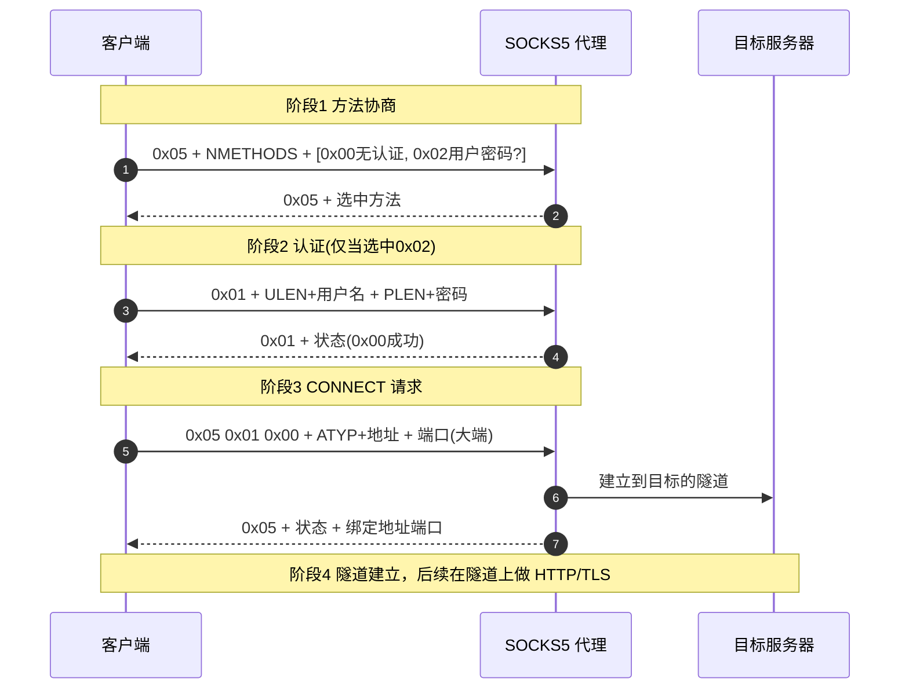
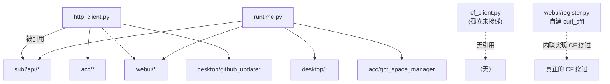

# 05 · 模块详解 · common 基础设施层

`newtoken/common/` 是与业务无关的传输与运行时基础设施，被几乎所有上层模块复用。包含三个文件 + 程序入口 + 打包脚本。

| 文件 | 行数 | 职责 | 引用方 |
|------|------|------|--------|
| `http_client.py` | ~451 | 标准库 HTTP + 手写 SOCKS5 | **10 个模块**（核心） |
| `runtime.py` | ~76 | 源码/打包路径解析 | 8 个模块 |
| `cf_client.py` | ~161 | CF 绕过（curl_cffi） | **0 个（孤立未接线）** |

---

## 1. http_client.py —— 零依赖 HTTP 客户端

这是全项目的 HTTP 核心。基于标准库 `http.client`，并**手写实现了 SOCKS5 代理协议**，不依赖 `requests`/`PySocks`。`sub2api`、`acc`、`webui`、`desktop` 的所有非 CF 请求都走它。

### 1.1 设计约定（重要）

- **HTTP 错误不抛异常**：4xx/5xx 照常返回三元组，只有网络层错误（OSError/SSL/timeout/SOCKS5）才抛 `RuntimeError("网络请求失败: ...")`。调用方自行判断状态码——这样能拿到错误响应体做精细分类。
- **代理仅支持 SOCKS5**：只认 `socks5://` / `socks5h://`，不支持 HTTP 代理（与 cf_client 不同）。

### 1.2 代理配置

`PROXY_ENV_KEYS` 优先级链（从高到低）：

```
显式参数 proxy_url
  → SUB2API_OUTBOUND_PROXY_URL
  → SUB2API_SOCKS5_PROXY_URL
  → SOCKS5_PROXY_URL
  → ALL_PROXY
  → all_proxy
```

| 函数 | 作用 |
|------|------|
| `get_configured_proxy_url(explicit=None)` | 按优先级返回生效代理 URL |
| `parse_socks5_proxy_url(url)` | 解析为 `Socks5ProxyConfig`，非 socks5 scheme 抛 ValueError；用户名密码经 `unquote` 解码 |
| `mask_proxy_url(url)` | 把凭据替换为 `***:***@host:port`，用于日志/前端展示 |
| `apply_proxy_env(url)` | 把代理写入**全部** 5 个环境变量别名（或全部清除）——**全局副作用**，影响后续所有 HTTP |

`Socks5ProxyConfig`（frozen dataclass）：`scheme`、`host`、`port`、`username`、`password`。

> `socks5` vs `socks5h`：前者客户端先解析 DNS 再连 IP，后者把域名交给代理解析（防 DNS 泄露）。

### 1.3 手写 SOCKS5 协议（RFC 1928/1929）



关键函数：
- `_read_exact(sock, n)`：循环 recv 直到精确读满 n 字节（TCP 流协议保证）。
- `_encode_socks5_address(host)`：自动判断地址类型——IPv4(`0x01`)→IPv6(`0x04`)→域名(`0x03`，IDNA 编码支持国际化域名)。
- `_connect_via_socks5(proxy, host, port, timeout)`：执行完整四阶段握手，返回已建隧道的 socket。错误码按 `SOCKS5_STATUS_TEXT` 查表（RFC 1928 八种）。

### 1.4 连接类与请求函数

- `SocksHTTPConnection` / `SocksHTTPSConnection`：继承标准库连接类，覆写 `connect()` 改用 SOCKS5 隧道；HTTPS 版在隧道上再 `wrap_socket`（SNI 正确设置）。
- `_build_connection(scheme, host, port, *, proxy, timeout)`：四路工厂（http/https × 有无代理）。

| 高层函数 | 返回 | 用途 |
|----------|------|------|
| `http_request_text(...)` | `(status, reason, text, headers)` | 文本响应；自动检测字符集 |
| `http_request_bytes(...)` | `(status, reason, bytes, headers)` | 二进制响应（下载） |
| `request_json(...)` | `(status, text, payload)` | **最常用**，JSON 解析失败返回 None；sub2api 全模块从此封装 |
| `http_get_json(url)` | dict/list | GET + 解析 + 非 2xx 抛异常 |
| `download_file(url, path)` | Path | 下载文件，超时默认 120s |

Body 优先级统一为 `json_body`（自动设 Content-Type）> `body`(str) > `body`(bytes)。`json_body` 用 `ensure_ascii=False` 编码（支持中文）。

---

## 2. runtime.py —— 源码/打包路径解析

解决"源码开发"与"PyInstaller 打包"两种模式下 `.env`、缓存文件落盘路径不一致的问题。被 8 个模块引用。

| 函数 | 作用 |
|------|------|
| `is_frozen_app()` | 检测 `sys.frozen`（PyInstaller 打包标志） |
| `get_executable_dir()` | exe 所在目录（打包模式） |
| `find_source_root(module_file)` | 向上找含 `newtoken/__init__.py` 的目录，返回其上级=项目根 |
| `get_app_dir(module_file)` | **核心**：打包→exe 目录；源码→项目根 |
| `resolve_app_file(module_file, filename)` | `get_app_dir() / filename`，最常用 |
| `ensure_on_sys_path(path)` | 幂等插入 sys.path[0] |
| `chdir_to_app_dir(module_file)` | 切工作目录到应用目录（桌面双击场景） |

> ⚠️ `find_source_root` 依赖目录名 `newtoken` 作为识别标志；若重命名包目录会 fallback 到模块所在目录，导致 `.env` 路径错误。

---

## 3. cf_client.py —— CF 绕过（⚠️ 孤立未接线模块）

设计意图是基于 `curl_cffi` 提供与 `http_client` 同签名的 CF 绕过传输层。**但经全仓库检索，`newtoken/` 内没有任何模块引用它**——它是一个未接线的孤立模块。真正生效的 CloudFlare 绕过在 `webui/register.py` 内联实现（自建 curl_cffi session，见 [04](./04-自动注册引擎.md)）。

### 3.1 核心机制（即使未接线也值得理解）

- `_IMPERSONATES = ["chrome120", "chrome124", "chrome131"]`：随机选一个浏览器 TLS 指纹。
- 模块级单例 `_session`：代理不变时复用 Session（保持 TLS 会话），代理变更才重建。
- `is_cf_challenge(text, status)`：状态码 403/503、空响应、或命中 `CF_MARKERS`（10 个 CF 特征字符串如 `"Just a moment"`、`turnstile`）即判为挑战页。
- `_rotate_session()`：检测到 CF 挑战后清空单例，下次用新指纹重试。
- 重试：`cf_request_*` 默认 retries=3，遇 CF 挑战换指纹 + 随机 sleep 1~3s。

### 3.2 ⚠️ 已确认的真实 Bug（`cf_request_json` 第 82 行）

```python
# cf_request_json：错误写法
resp = getattr(session, method.lower())(
    "get" if method.upper() == "GET" else method.lower(),  # ← 把方法名当成了第一个位置参数
    url, **kwargs)
```

`getattr(session, "get")` 得到 `session.get`，而 `session.get(url, ...)` 的第一个位置参数应是 URL。这里却把字符串 `"get"` 当作 URL 传入、真正的 url 落到第二个参数，导致请求目标错误。

对比正确写法（`cf_request_text` 第 124 行）：
```python
resp = session.request(method.upper(), url, **kwargs)   # ← 正确
```

**影响范围**：因为 cf_client 是孤立模块（仅 `cf_test` 内部调用 `cf_request_json`，而 `cf_test` 本身也无外部调用方），该 bug 实际不影响任何运行路径。但若未来要启用 cf_client，必须先修复（统一改为 `session.request(method.upper(), url, **kwargs)`）。

### 3.3 与 http_client 的代理差异

cf_client 的 `_resolve_proxy` 把代理字符串直接交给 curl_cffi（支持 socks5/http 全协议）；而 http_client 仅支持 socks5。两者环境变量优先级一致（cf_client 少了 `all_proxy` 小写项）。

---

## 4. entry.py —— WebUI 服务入口

```python
from newtoken.webui.server import main
if __name__ == "__main__":
    raise SystemExit(main())
```

仅 3 行有效代码，全部委托 `webui.server.main()`。`raise SystemExit(main())` 把返回值作为进程退出码。默认端口 28463（环境变量 `SUB2API_WEB_HOST`/`SUB2API_WEB_PORT` 可覆盖）。

---

## 5. tools/build_sub2api_standalone_exe.py —— PyInstaller 打包脚本

把 `desktop/standalone_tool.py` 打包成 Windows exe。

- 所有路径用 `Path(__file__).resolve().parents[1]` 从脚本位置推导，不依赖工作目录。
- `build_pyinstaller_command`：组装命令，关键参数 `--windowed`（隐藏控制台）、`--name Sub2API独立工具`、`--paths PROJECT_DIR`（确保 `newtoken` 包可被找到）、`--onefile`/`--onedir`。
- `emit_console_line`：用 `backslashreplace` 安全输出，解决 Windows GBK 控制台中文崩溃。
- `copy_release_support_files`：复制 `.env.example` + 生成 `首次使用说明.txt`。
- 命令行参数：`--python`（指定解释器）、`--onefile`（单文件）、`--dry-run`（只打印不执行）。

---

## 6. scripts/启动Sub2API独立工具.bat —— Windows 启动脚本

`cd /d "%~dp0"` 切到脚本目录 → `cd ..` 回项目根（让 `newtoken` 包可导入），按三级优先级找 Python 运行时：

1. **Codex 自带运行时**：`%USERPROFILE%\.cache\codex-runtimes\codex-primary-runtime\dependencies\python\python.exe`（复用 ChatGPT Desktop 的 Python，免装）。
2. `py` launcher。
3. PATH 中的 `python`。

都没有则提示错误并 pause。运行 `-m newtoken.desktop.standalone_tool`。

---

## 7. 模块依赖关系



---

## 小结

- `http_client.py` 是核心 HTTP 基础设施：零依赖、手写 SOCKS5、HTTP 错误不抛异常。
- `runtime.py` 统一源码/打包路径，是 `.env` 与缓存定位的基础。
- `cf_client.py` 是孤立未接线模块且含 `cf_request_json` 真实 bug（但不影响运行）；真正的 CF 绕过在 `register.py`。
- entry/打包脚本/bat 构成入口与分发链路。

下一篇：[06-模块详解-acc席位管理](./06-模块详解-acc席位管理.md)。
