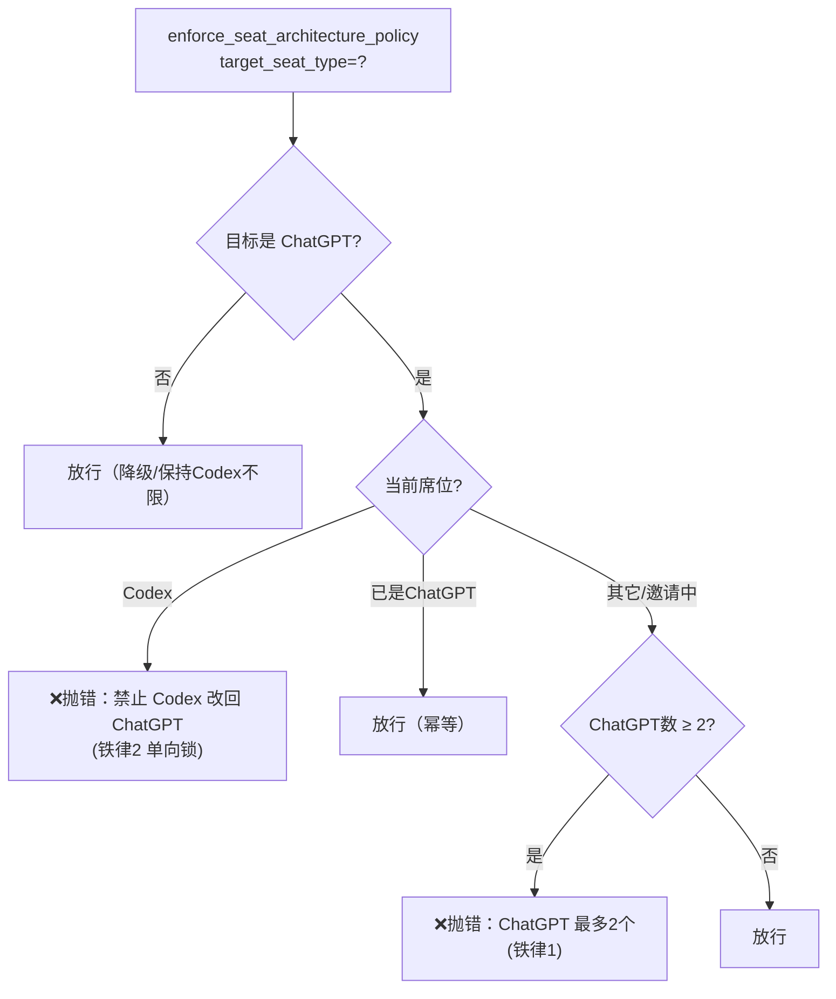
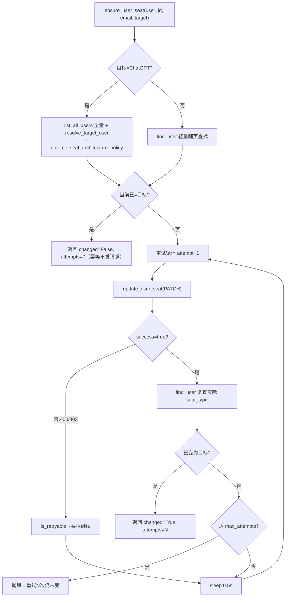
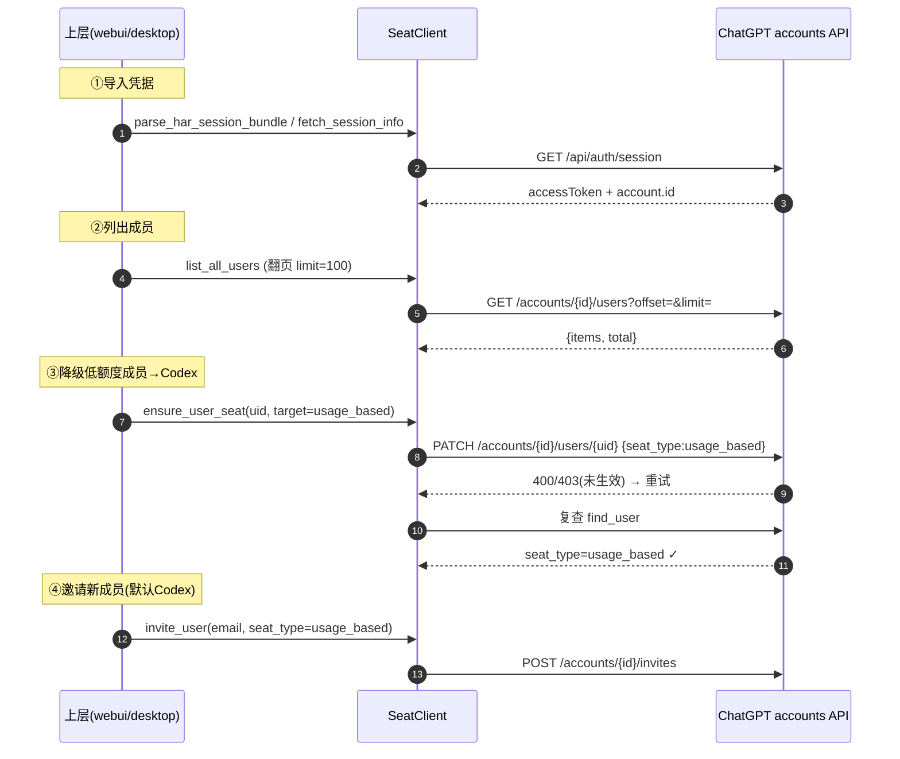

# 06 · 模块详解 · acc 席位管理

`newtoken/acc/` 是"席位管理"的纯逻辑能力层（底层 SDK），不含 UI、不含调度。被 `webui/acc.py`、`desktop/acc_seat_ui.py` 等上层复用。

| 文件 | 行数 | 职责 | 鉴权方式 | API 域 |
|------|------|------|----------|--------|
| `seat_client.py` | ~781 | 席位 SDK + 状态机 + CLI | Bearer / session cookie | `/backend-api/accounts/...` |
| `gpt_space_manager.py` | ~256 | 组织成员管理 | session cookie（HAR 提取） | `/backend-api/organizations/...` |
| `cache.py` | ~209 | 本地缓存读写 | — | — |
| `local_env.py` | ~82 | `.env` 读写 + Mailcow 配置 | — | — |

> ⚠️ **两套平行 API**：`seat_client` 走 **accounts** 接口（账号维度），`gpt_space_manager` 走 **organizations** 接口（组织维度），鉴权和路径都不同，不要混用。

---

## 1. seat_client.py —— 席位 SDK（最核心）

三重身份：① 库（`SeatClient` + 一组纯函数）；② CLI 脚本（`list`/`toggle`/`set-seat`）；③ 全项目席位常量的唯一来源。

### 1.1 模块级常量

| 常量 | 值 | 含义 |
|------|-----|------|
| `CLIENT_BUILD_NUMBER` | `"7295677"` | `oai-client-build-number` 头（**硬编码，会随前端更新过期**） |
| `CLIENT_VERSION` | `"prod-6fad808b4f8e564864e3be9a01e210e4d978ffac"` | `oai-client-version` 头 |
| `DEFAULT_BASE_URL` | `"https://chatgpt.com"` | 接口域名 |
| `CHATGPT_SEAT_TYPE` | `"default"` | ChatGPT 席位枚举 |
| `CODEX_SEAT_TYPE` | `"usage_based"` | Codex 席位枚举 |
| `CHATGPT_SEAT_LIMIT` | `2` | **ChatGPT 席位硬上限** |
| `SEAT_LABELS` | `{"default":"ChatGPT","usage_based":"Codex","null":"ChatGPT"}` | 枚举→中文 |
| `DEFAULT_INVITE_SEAT_TYPE` | `"usage_based"` | 邀请默认 = Codex |
| `DEFAULT_BROWSER_USER_AGENT` | Windows Chrome 149 UA | 反检测 UA |
| `TRANSIENT_NETWORK_EXCEPTIONS` | `(URLError, RemoteDisconnected, ConnectionResetError, TimeoutError)` | 可重试网络异常 |

> **席位只有两种**：`default`（含 `null`/`None`/空 = ChatGPT）和 `usage_based`（Codex）。

### 1.2 Config 与 SeatClient

`Config`（dataclass）：`access_token`、`account_id`、`device_id`、`session_token`、`client_build_number`、`client_version`、`base_url`。鉴权：`access_token`(Bearer) 与 `session_token`(Cookie) 至少一个，`account_id` 必填。

`SeatClient` 三个公开方法（HTTP 契约见 [11](./11-外部接口对接.md)）：

| 方法 | 请求 | 说明 |
|------|------|------|
| `list_users(page, limit, query)` | GET `/backend-api/accounts/{account_id}/users?offset=&limit=&query=` | 返回 `{items, total, page, limit}` |
| `update_user_seat(user_id, seat_type)` | PATCH `/backend-api/accounts/{account_id}/users/{user_id}` body `{seat_type}` | 期待 `{success:true}` |
| `invite_user(email, role, seat_type, resend)` | POST `/backend-api/accounts/{account_id}/invites` | 新邀请默认 `usage_based`(Codex) |

### 1.3 请求头构造（反检测）

`build_headers(config)` 固定头：`accept`、`accept-language: zh-CN,zh;q=0.9`、`account-id`、`oai-client-build-number`、`oai-client-version`、`referer`、`sec-fetch-*`、Windows Chrome 149 `user-agent`；条件头：有 token 加 `authorization: Bearer`、有 device_id 加 `oai-device-id`、有 session 加 `cookie`。

`build_session_cookie(token)`：同一 token 同时塞进 `__Secure-next-auth.session-token` 和 `next-auth.session-token` 两个 cookie 名（兼容 https/http）。

### 1.4 重试传输

`request_json_with_retry(url, method, headers, payload, max_attempts=3, retry_delay=0.5)`：
- 业务错误（status <200 或 ≥300）→ `extract_error_message` 组装后抛 `SeatApiError`，**不重试**。
- 网络瞬时错误（`TRANSIENT_NETWORK_EXCEPTIONS + RuntimeError`）→ sleep 后重试。
- `decode_json_response`：空串→`{}`；非 JSON 抛错；非 dict 抛错。

### 1.5 席位状态判定纯函数（状态机核心）

| 函数 | 逻辑 |
|------|------|
| `next_seat_type(current)` | **永远返回 Codex**（toggle 实质只能降级） |
| `is_chatgpt_seat_type(t)` | `t in {default, null}`（含 None/空） |
| `is_codex_seat_type(t)` | `t == usage_based` |
| `count_chatgpt_seats(users)` | 统计 ChatGPT 席位数 |
| `select_chatgpt_overflow_users(users, limit=2)` | 返回 `chatgpt_users[limit:]`（溢出者，**按列表顺序，无优先级**） |
| `seat_label(t)` | None→"-"；查 SEAT_LABELS |

### 1.6 两条铁律 `enforce_seat_architecture_policy`

只在"目标=ChatGPT"时触发校验（降级/保持 Codex 不受限）：

### 1.7 席位变更引擎 `ensure_user_seat`（核心）

`is_retryable_seat_update_error`：消息含 `400 + bad request` 或 `403 + forbidden` → 可重试。

> **业务含义**：ChatGPT 后端在席位刚改后短时间内会对 PATCH 返回 400/403（状态未生效/风控），本引擎把它当瞬时错误，反复 PATCH + 复查直到生效——这是绕过"席位修改延迟"的核心手法。
>
> ⚠️ **坑**：`max_attempts=None`（默认）时**无限重试**。上层定时任务务必传 `max_attempts`，否则单个卡住的席位会拖垮整轮维护。

### 1.8 收敛 `enforce_chatgpt_seat_limit`

`users` 为空则先 `list_all_users`；对 `select_chatgpt_overflow_users` 的溢出者逐个 `ensure_user_seat(→Codex)`；返回 `{limit, overflow_count, changed_users, users, chatgpt_count}`。

### 1.9 凭据获取（HAR/session）

| 函数 | 作用 |
|------|------|
| `fetch_session_info(base_url, session_token)` | GET `/api/auth/session`，用 session 反查 |
| `extract_session_credentials(data)` | 取 `accessToken` + `account.id` |
| `parse_har_session_bundle(har_text)` | 从 HAR 提取首个 200 的 users 请求头（account-id/device-id/build/version）+ session 响应，返回 8 字段标准 payload |
| `find_user` / `list_all_users` / `resolve_target_user` | 翻页查找（limit=100）/拉全量/单页定位 |

### 1.10 CLI

`main()` 三子命令：`list`（表格展示）、`toggle`（用 `next_seat_type` → 永远 Codex）、`set-seat`（`--seat-type` 仅 default/usage_based）。配置走命令行参数或 `OPENAI_*` 环境变量。

---

## 2. gpt_space_manager.py —— 组织成员管理（平行实现）

与 seat_client 是两套平行实现：**纯 session cookie 鉴权**（不用 Bearer），走 **organizations** 接口，UA 仅 `Mozilla/5.0`（反检测比 seat_client 弱）。

- `CHATGPT_API_BASE = "https://chatgpt.com/backend-api"`
- `HarSession`（dataclass）：`session_token`、`csrf_token`、`user_agent`、`cookie_str`；`is_valid = bool(session_token)`。
- 会话缓存：`get_app_dir()/.chatgpt_session.json`（save/load/clear）。
- `parse_har_file(path)`：从 HAR 提取 session_token（cookie 或 set-cookie）+ csrf_token。
- `fetch_team_members(session)`：GET `/organizations/members`，**失败 fallback** 探测 `/accounts/check/v4-2024-10-25` 后重试；标准化为 `{email, name, seat_type, status}`。
- `add_team_member(session, email, seat_type="codex")`：POST `/organizations/members`；**失败 fallback** 两步：`POST /organizations/invites` 拿 invite_id → `POST /organizations/invites/{id}/assign-seat`。

> ⚠️ 席位字符串不一致：seat_client 用 `usage_based`，这里默认 `"codex"`（对应 organizations 接口语义）。fallback 设计反映 Team vs Business 工作区接口形态差异。

---

## 3. cache.py —— 本地缓存

ACC 页面的本地落盘缓存（4 类）+ `Sub2APIUsageSnapshot` 序列化。所有函数接收 `Path` 参数（路径由调用方决定）。

| 缓存 | 结构 | key | 特殊处理 |
|------|------|-----|----------|
| ACC 原文输入 | 纯文本 | — | 空内容删文件 |
| 额度快照 | `{"lookup":{email:payload}}` | **小写 email** | email 空丢弃；JSON 损坏返回 `{}` |
| 成员列表 | `{"items":[...]}` | — | 只留 dict |
| UI 设置 | `{...}` | — | 写入白名单仅 `auto_refresh_seconds` |

`Sub2APIUsageSnapshot`（额度标准结构，定义在 `sub2api/usage_bridge.py`）字段：`account_id`、`name`、`email`、`quota_5h_text`、`quota_7d_text`、`usage_updated_at`、`quota_5h/7d_remaining_percent`、`account_status`、`quota_5h/7d_reset_at`、`quota_5h/7d_reset_after_seconds`。

> 额度缓存以**小写 email** 为 key——因为席位（成员）与 Sub2API 账号唯一可靠的关联就是邮箱。

---

## 4. local_env.py —— .env 读写

`.env` 文件的保序读写（按 `ENV_KEY_ORDER` 排列已知键，未知键字母序追加）。

`ENV_KEY_ORDER` 19 项分两组：
- **OpenAI 组（7）**：`OPENAI_ACCESS_TOKEN/ACCOUNT_ID/DEVICE_ID/SESSION_TOKEN/CLIENT_BUILD_NUMBER/CLIENT_VERSION/BASE_URL`。
- **Mailcow 组（12）**：`MAILCOW_BASE_URL/API_KEY/DOMAIN/DEFAULT_PASSWORD/MAILBOX_PREFIX/DISPLAY_NAME_PREFIX/MAILBOX_QUOTA_MB/IMAP_HOST/IMAP_PORT/IMAP_SSL/IMAP_FOLDER`。

> ⚠️ **Mailcow 配置当前未被使用**：经全仓库检索，`MAILCOW_*` / IMAP 仅在 `local_env.py` 中定义，无任何模块读取。它"设计上"支持用 Mailcow 自建邮件系统批量创建邮箱 + IMAP 收 OpenAI 验证邮件（即"邮箱+验证码"注册路径），但**当前生效的 `register.py` 走企业 SSO 免验证码**，不读这些字段。Mailcow 组疑为备用或历史方案。详见 [13](./13-已知问题与维护要点.md)。

函数：`parse_env_value`（处理引号/JSON 转义）、`read_env_file`、`write_env_file`（先 merge 旧文件保留未知键，值用 `json.dumps(ensure_ascii=False)` 序列化）。

---

## 5. 席位生命周期时序

---

## 6. 模块关系与坑点

### 调用关系
- `webui/acc.py` import `seat_client as seat_core`，是主战场（`enforce_acc_low_quota_policy` 等）。
- `desktop/acc_seat_ui.py` import `seat_client as core` + `acc.cache` + `acc.local_env`。
- `desktop/gpt_space_manager_ui.py` import `acc.gpt_space_manager`。
- `cache.py` **反向依赖** `sub2api.usage_bridge.Sub2APIUsageSnapshot`。

### 坑点
1. `CLIENT_BUILD_NUMBER=7295677` / `CLIENT_VERSION` 硬编码真实前端版本号，会随 ChatGPT 更新过期 → 触发风控，高优先级维护点。
2. `ensure_user_seat(max_attempts=None)` 默认无限重试。
3. 400/403 被当瞬时错误重试——既是绕过延迟的手段，也是潜在接口滥用风险（易触发限频）。
4. `select_chatgpt_overflow_users` 按列表顺序切片降级，无优先级（不保证降的是最该降的）。
5. acc 调用不显式传 proxy，是否走代理完全取决于进程环境变量。
6. `gpt_space_manager` 反检测弱（UA 简陋、无 oai-* 头），与 seat_client 不要混用。

---

## 小结

- `seat_client` 是席位 SDK（accounts API）：常量唯一来源、状态机、`ensure_user_seat` 重试引擎、两条铁律。
- `gpt_space_manager` 是平行的组织成员管理（organizations API + session cookie）。
- `cache` 以 email 为 key 缓存额度/成员；`local_env` 读写 `.env`（Mailcow 组当前未用）。
- 核心坑：硬编码版本号、无限重试、400/403 当可重试。

下一篇：[07-模块详解-sub2api对接](./07-模块详解-sub2api对接.md)。
