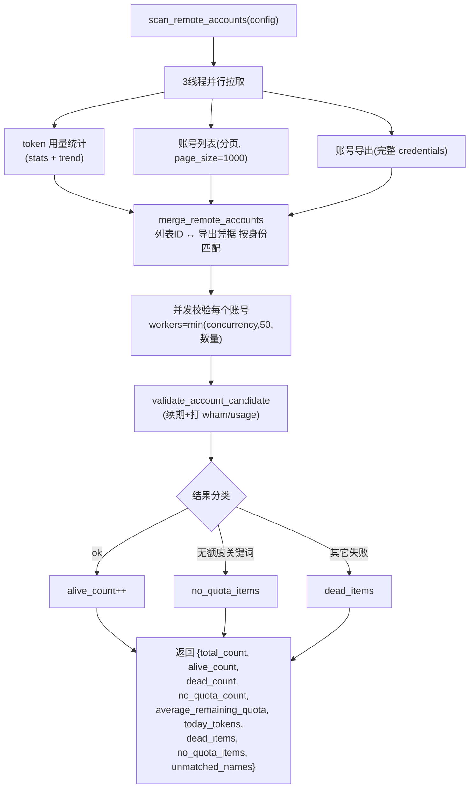
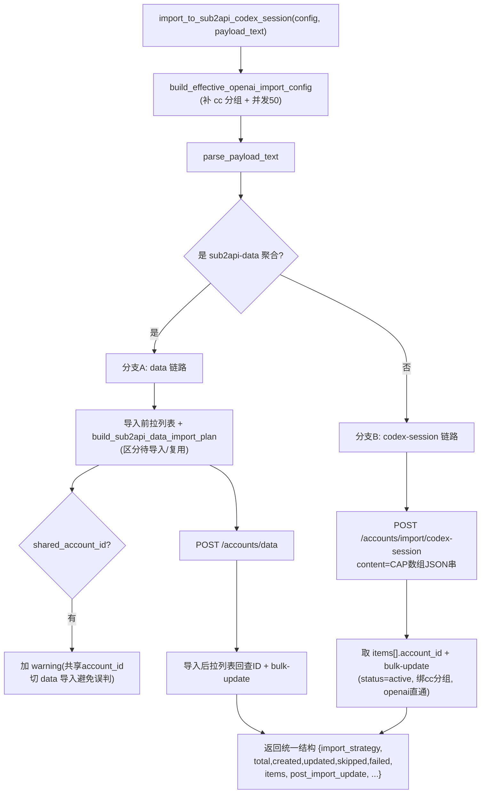
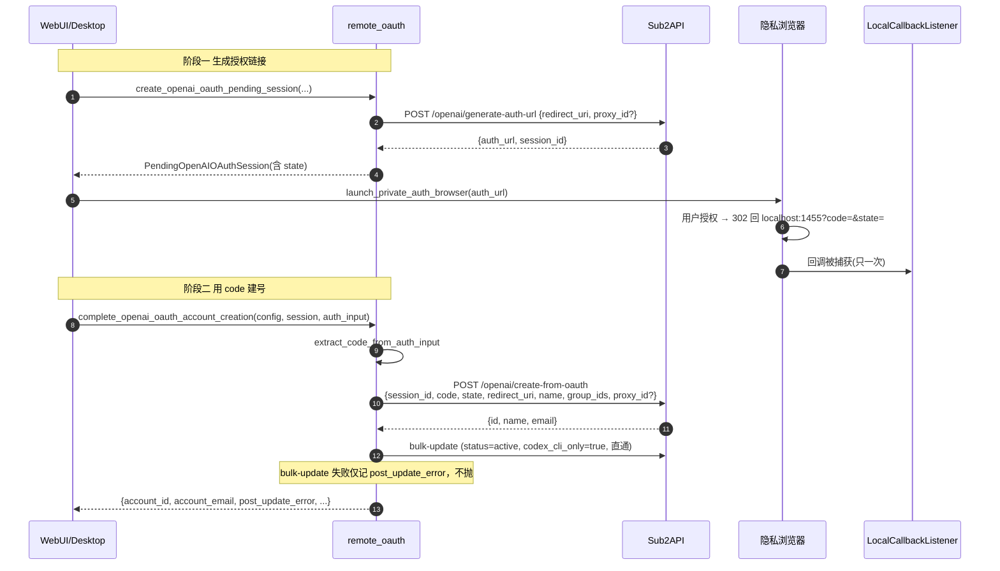
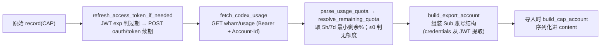

# 07 · 模块详解 · sub2api 对接

`newtoken/sub2api/` 负责"把 ChatGPT 订阅账号转换并导入 Sub2API 网关"，是能力层最大的模块。提供自动维护主干的两大函数 `scan_remote_accounts`（扫描）和 `import_to_sub2api_codex_session`（导入）。

| 文件 | 行数 | 职责 |
|------|------|------|
| `remote.py` | 1287 | Sub2API 管理端对接（扫描/导入/删除/批量更新主干） |
| `converter_core.py` | 731 | token 校验/转换/JWT 解码/额度查询 |
| `remote_oauth.py` | 705 | OpenAI OAuth 远程一键建号 |
| `usage_bridge.py` | 633 | ACC↔远程 额度/状态桥接 |
| `converter_archive.py` | 108 | 压缩包解压辅助 |

**依赖层次（无循环）**：
```
common(http_client/runtime) → converter_core → remote → {remote_oauth, usage_bridge}
converter_archive 完全独立
```

所有远程请求最终走 `common.http_client.request_json`（HTTP 错误不抛、返回三元组）。

---

## 1. converter_core.py —— token 转换核心

不涉及任何 Sub2API 远程接口，纯做 token 的校验与格式转换。

### 1.1 关键常量

| 常量 | 值 | 用途 |
|------|-----|------|
| `MAX_CONCURRENT_CHECKS` | `50` | 最大并发校验数 |
| `TOKEN_REFRESH_SKEW_SECONDS` | `300` | 提前 5 分钟视为过期 |
| `TOKEN_ENDPOINT` | `https://auth.openai.com/oauth/token` | token 续期端点 |
| `USAGE_URL` | `https://chatgpt.com/backend-api/wham/usage` | 额度查询端点 |
| `OAUTH_CLIENT_ID` | `app_EMoamEEZ73f0CkXaXp7hrann` | Codex CLI client_id |
| `DEFAULT_OUTPUT_MODE` / `CAP_OUTPUT_MODE` | `"sub"` / `"cap"` | 两种导出格式 |
| `AUTH_FAILURE_KEYWORDS` | invalid_grant / unauthorized / refresh_token_expired ... | 授权失效识别 |
| `QUOTA_FAILURE_KEYWORDS` | usage_limit_reached / quota exceeded / at capacity ... | 额度不足识别 |

### 1.2 数据结构

- `AccountCandidate`：`order`、`folder_name`、`file_name`、`file_path`、`record`（待校验账号来源）。
- `AccountCheckResult`：`order`、`email`、`status`(`ok`/`auth_error`/`quota_error`/`other_error`)、`reason`、`account`(Sub 结构)、`remaining_quota`。
- `AccountCheckFailure(Exception)`：`category`、`reason`、`status_code`（统一失败异常）。

### 1.3 额度判定（核心语义）

- `parse_usage_quota(payload)`：解析 `wham/usage` 的 `rate_limit`，分 `primary_window`(5h) 和 `secondary_window`(7d)，各算剩余百分比、重置时间、窗口分钟。
- `resolve_remaining_quota(quota)`：**取存在窗口的剩余百分比最小值**作为可用额度；无窗口时按 `allowed`/`limit_reached` 返回 0 或 100。这就是"最小剩余额度"语义的来源。

### 1.4 token 续期 `refresh_access_token_if_needed`

```mermaid
flowchart TD
    S["refresh_access_token_if_needed(record)"] --> E{is_token_expired?<br/>(exp ≤ now+300)}
    E -->|否| RET["返回原 record（不刷新）"]
    E -->|是| RT{有 refresh_token?}
    RT -->|否| ERR["抛 auth_error"]
    RT -->|是| POST["POST auth.openai.com/oauth/token<br/>{client_id, grant_type:refresh_token, refresh_token}"]
    POST --> OK{2xx?}
    OK -->|否| CLS["classify_failure 分类后抛"]
    OK -->|是| UPD["写回 access/id/refresh_token，返回新 record"]
```

`classify_failure(status, detail, body)`：401 或命中 AUTH 关键词→`auth_error`；命中 QUOTA 关键词或 403/429→`quota_error`；否则 `other_error`。

### 1.5 额度查询 `fetch_codex_usage`

GET `USAGE_URL`，头带 `Authorization: Bearer` + `ChatGPT-Account-Id`。`resolve_remaining_quota` **≤0 时抛 `quota_error("无可用额度（最小剩余额度 x%）")`**——这条文案是 `remote` 区分"无额度"vs"死号"的依据。

### 1.6 校验入口 `validate_account_candidate`（被扫描复用）

```
record → refresh_access_token_if_needed（续期）
       → fetch_codex_usage（查额度，≤0 抛 quota_error）
       → resolve_remaining_quota（算剩余）
       → AccountCheckResult(status=ok, account=build_export_account(...), remaining_quota=x)
```

### 1.7 格式互转（字段映射）

`extract_candidate_records_from_payload` 统一归一化三种输入（单 CAP / CAP 数组 / sub2api-data 聚合）→ CAP 记录数组。

**`build_export_account`**（CAP→Sub，从 JWT 提取）：
```python
{"name":email, "platform":"openai", "type":"oauth",
 "credentials":{access_token, expires_at, refresh_token, id_token, email,
                chatgpt_account_id, chatgpt_account_user_id, chatgpt_user_id,
                plan_type, subscription_expires_at},
 "concurrency":0, "priority":0}
```

**`build_cap_account`**（Sub→CAP，导入用）：
```python
{"id_token","access_token","refresh_token","account_id","last_refresh",
 "email", "type":"codex", "expired"}
```

JWT 命名空间字段来源：access_token 的 `https://api.openai.com/auth`（chatgpt_account_id 等）和 `/profile`（email）；id_token 的 `/auth`（subscription_active_until）。`decode_jwt_payload` **只解码不验签**。

---

## 2. remote.py —— Sub2API 管理端对接（最核心）

### 2.1 鉴权与响应壳

- `Sub2APIRemoteConfig`（dataclass）：`base_url`、`admin_api_key`、`group_ids`、`proxy_id`、`concurrency`、`priority`、`update_existing`、`skip_default_group_bind`、`confirm_mixed_channel_risk`。
- `build_sub2api_admin_headers(key)` → **`{"x-api-key": <key>, "Accept": "application/json"}`**（管理员鉴权用 `x-api-key` 头）。
- `unwrap_sub2api_response(payload)` → 校验 `code` 为 0/缺失，返回 `data`。**Sub2API 标准响应壳：`{"code":0, "message":"", "data":{...}}`**。
- `normalize_sub2api_base_url` → 去尾斜杠、校验 scheme、保留反代子路径。

### 2.2 主干一：`scan_remote_accounts`



> **主干消费**：`auto.py` 用 `quota_ok = alive_count - no_quota_count` 与阈值比较。注意：`unmatched_names`（列表与导出未匹配上的）**不计入 total_count**。每个候选都会真实打一次 OpenAI `wham/usage`，账号多时是风控高发点。

### 2.3 主干二：`import_to_sub2api_codex_session`



**导入后 bulk-update** `build_openai_post_import_update_payload`：把账号设 `status=active`、绑 `group_ids`、`extra.openai_passthrough=true` + `openai_oauth_responses_websockets_v2_*` 直通。

**防误判**：`detect_shared_chatgpt_account_ids` 识别多 owner 共享同一 `chatgpt_account_id`，自动切 data 导入（codex-session 会误判重复）。

### 2.4 账号匹配去重

`build_openai_account_match_keys` 生成匹配键优先级：`user:<chatgpt_user_id>` → `email:` → `refresh:<指纹>` → `access:<指纹>`。`fingerprint_secret` 用 sha256 对 token 做指纹（不暴露原文）。`find_existing_remote_account_id` 按匹配键回查避免重复导入。

### 2.5 删除/隐私/批量

| 函数 | 端点 |
|------|------|
| `delete_remote_account` | DELETE `/accounts/{id}` |
| `delete_dead_remote_accounts` | 按 id 去重并发删除（并发=min(10,数量)） |
| `bulk_update_remote_accounts` | POST `/accounts/bulk-update` |
| `set_all_remote_openai_account_privacy` | 并发逐个 POST `/accounts/{id}/set-privacy` |
| `test_sub2api_connection` | GET `/accounts?page=1&page_size=1`（探活+验密钥） |

死号筛选：`is_remote_no_quota_item`（reason 含"无可用额度"/"最小剩余额度"）；`select_remote_accounts_with_auth_error`（status=auth_error 或 reason 含 401/402/token_invalidated 等）。

---

## 3. remote_oauth.py —— OpenAI OAuth 远程建号

通过 Sub2API 后台的 OpenAI 专用端点完成 OAuth 建号，并内置本地 localhost 回调监听。

### 3.1 数据结构与回调监听

- `PendingOpenAIOAuthSession`：`session_id`、`state`、`auth_url`、`account_name`、`proxy_id`、`group_ids`、`redirect_uri`、`concurrency`。
- `LocalOAuthCallbackListener`：起 `ThreadingHTTPServer` 监听 `redirect_uri`（默认 `localhost:1455`），用 Lock + `_handled` 确保**只回调一次**（防重复建号），处理后自关。仅允许 localhost/http。

### 3.2 两阶段建号



> **PKCE 在服务端**：`code_verifier` 由 Sub2API 在 session 内维护，本端只传 `session_id + code + state`，所以建号必须用同一 session。

### 3.3 代理与分组

- `ensure_remote_proxy_by_url`：查到复用，否则 `create_remote_proxy` 创建。
- `resolve_remote_group_ids`：显式则用，否则找 name=cc 且 platform 为空/openai 的分组。
- 浏览器：`launch_private_auth_browser` 找 msedge(`--inprivate`)/chrome(`--incognito`)，关旧窗开新窗。

---

## 4. usage_bridge.py —— 额度/状态桥接

连接"本地 ACC 席位工具（按 email）"与"Sub2API 远程账号"的双向桥。**自助式**（自己从 `.env` 读配置，不需上层传 config）。

### 4.1 数据结构

- `Sub2APIUsageSnapshot`：额度快照（见 [06](./06-模块详解-acc席位管理.md) cache 节）。
- `Sub2APIRemoteAccountSummary`：`account_id`、`email`、`name`、`plan_type`、`status`。
- `Sub2APIUsageLoadResult`：`config_path`、`remote_total`、`lookup`、`summaries`。

### 4.2 关键函数

- `extract_snapshot_from_account_item`：从远程账号 `extra` 读额度——**关键契约字段**：`codex_5h_used_percent`、`codex_7d_used_percent`、`codex_usage_updated_at`、`codex_5h/7d_reset_at`、`codex_5h/7d_reset_after_seconds`。
- `load_sub2api_usage_lookup(env_path)`：拉列表 → 按 email 建 `{email→Snapshot}`。被 `webui/acc.py` 调用展示席位额度。
- `set_remote_accounts_status(ids, status)` / `set_remote_accounts_inactive(ids)`：→ `bulk-update {account_ids, status}`。
- `refresh_remote_accounts_serial(ids)` / `recover_remote_accounts_state(ids)`：**串行**刷新/恢复（席位切换后稳定恢复，避免批量触发风控）。

> **与 converter_core 的区别**：converter_core **实时**打 OpenAI `wham/usage`（扫描判活）；usage_bridge **读取 Sub2API 后台已缓存**的 codex 额度（展示用，不打 OpenAI）。

---

## 5. converter_archive.py —— 压缩包解压

独立小工具（仅 shutil/pathlib）。`extract_archives_in_directory` 递归扫描目录，支持 `.zip/.tar/.tar.gz/...` 解压到同名目录（已存在则 skip，失败回滚）。不支持 `.rar/.7z`。服务于"批量导入前先解压账号包"。

---

## 6. token 转换流水线



---

## 7. 坑点

1. **HTTP 错误静默**：`request_json` 对 4xx/5xx 不抛，每个函数都显式判 status_code，新增调用务必照做。
2. **JWT 不验签**：过期/篡改 token 不在解码时报错，靠 wham/usage 实际调用暴露。
3. **共享 chatgpt_account_id**：codex-session 导入会误判重复，已自动切 data 导入（`detect_shared_chatgpt_account_ids` + warning）。
4. **`unmatched_names` 不计入 total_count**：列表与导出不一致时漏统计，需关注此告警。
5. **scan 高频打 OpenAI**：每个候选都续期+查额度，账号多时是风控/限流热点（403/429→quota_error）。
6. **import 前后两次拉全量列表**（data 链路），账号池大时开销显著。
7. **本地回调端口 1455**：被占则起服务失败，仅支持 localhost/http。
8. **两处 cc 分组解析口径不同**：`remote` 要求 platform=openai，`remote_oauth` 允许 platform 为空。

---

## 小结

- `converter_core` 是 token 校验/转换底座：续期、查额度（最小剩余）、CAP↔Sub 互转、`validate_account_candidate`。
- `remote` 是远程管理端核心：`x-api-key` 鉴权、`{code,message,data}` 响应壳、`scan_remote_accounts` 与 `import_to_sub2api_codex_session` 两大主干、共享 account_id 防误判。
- `remote_oauth` 两阶段建号（PKCE 在服务端）；`usage_bridge` 读缓存额度 + 串行刷新；`converter_archive` 独立解压。

下一篇：[08-模块详解-webui服务](./08-模块详解-webui服务.md)。
