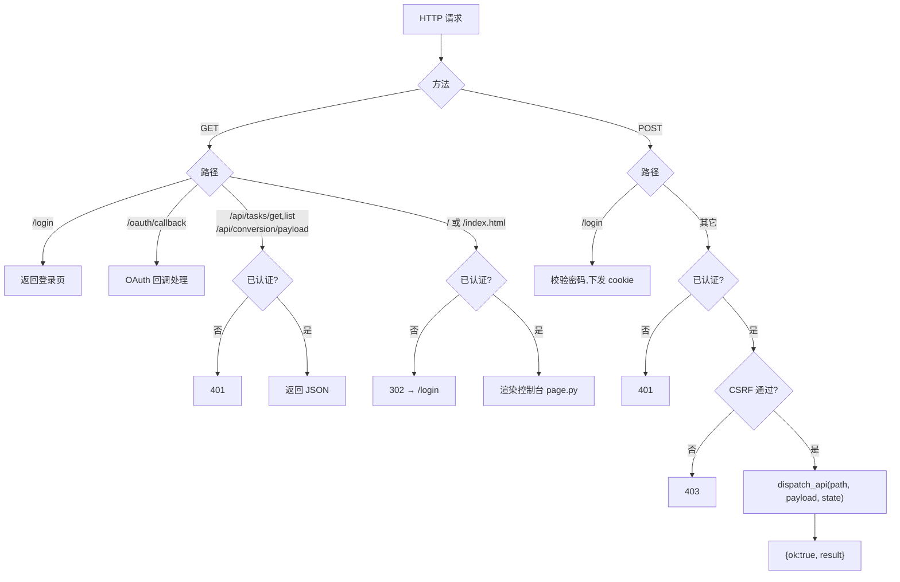
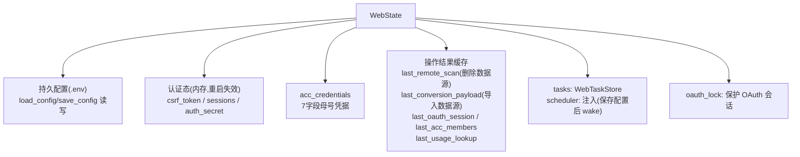

# 08 · 模块详解 · webui 服务

`newtoken/webui/`（24 个文件）既是 HTTP 交互层，也是自动维护的编排层。本文聚焦 HTTP 服务、配置中枢、路由、安全与前端；调度/任务/流水线/注册已在 [03](./03-自动维护流水线.md)、[04](./04-自动注册引擎.md) 详述，此处只做索引。

### 文件分类

| 类别 | 文件 | 说明 |
|------|------|------|
| HTTP 服务 | `server.py`、`server_auth.py` | 路由、认证、登录/回调 HTML |
| 配置中枢 | `config.py` | `WebState` + .env 读写（详见 [10](./10-配置与环境变量.md)） |
| API 分发 | `api.py` | POST /api/* 动作分发 |
| 编排（已详述） | `scheduler.py`、`tasks.py`、`auto.py` | 见 [03](./03-自动维护流水线.md) |
| 业务编排 | `acc.py`、`register.py`、`oauth.py`、`conversion.py`、`remote.py`、`monitor.py` | acc/register 见 [04](./04-自动注册引擎.md) |
| 外部客户端 | `oidc_client.py` | 调用 OIDC 发卡 |
| 工具/门面 | `utils.py`、`actions.py` | |
| 前端资产 | `page.py`、`assets.py`、`page_oauth_html.py`、`assets_js/css/oauth_js/acc_js.py` | HTML/CSS/JS 内联 |

---

## 1. server.py —— HTTP 服务与路由

基于标准库 `ThreadingHTTPServer` + `BaseHTTPRequestHandler`，无 Web 框架。

### 1.1 启动流程 `main()`

```python
state = WebState(env_path)          # 配置中枢
values = state.load_config()
host, port = resolve_server_bind(...)  # 默认 0.0.0.0:28463
scheduler = WebScheduler(state)
state.scheduler = scheduler          # 注入
server = Sub2APIWebServer((host, port), WebUIHandler, state)
scheduler.start()                    # 启后台调度线程
server.serve_forever()               # 主线程处理 HTTP
```

`Sub2APIWebServer` 继承 `ThreadingHTTPServer`（`daemon_threads=True`），携带 `state`。

### 1.2 请求处理流程



### 1.3 认证与安全机制

| 机制 | 实现 |
|------|------|
| **登录** | `POST /login` 校验 `password == state.auth_secret`（`SUB2API_WEB_SECRET`）。成功生成 `secrets.token_urlsafe(24)` 写入 `state.sessions`，下发 `Set-Cookie: sub2api_web_session=...; HttpOnly; SameSite=Lax; Path=/` |
| **会话校验** | `_is_authorized()`：Cookie 里的 session id ∈ `state.sessions` |
| **CSRF** | `_check_csrf()`：请求头 `X-CSRF-Token == state.csrf_token`（进程启动时生成一次，前端从主页注入）|
| **请求体上限** | `MAX_REQUEST_BODY_BYTES = 4MB` |
| **空密码** | `auth_secret` 为空时免登录（公网部署风险点）|

> 注意：Cookie 有 `HttpOnly` + `SameSite=Lax` 但**无 `Secure`**（默认 HTTP 部署）。session/csrf 都是内存态，进程重启失效。

---

## 2. config.py —— WebState 配置中枢

整个 WebUI 的"配置中枢 + 运行时共享状态容器"，被所有模块共享。环境变量 schema 详见 [10-配置与环境变量](./10-配置与环境变量.md)，此处讲运行时状态与方法。

### 2.1 关键常量

| 常量 | 值 |
|------|-----|
| `WEB_DEFAULT_PORT` | `28463` |
| `SESSION_COOKIE_NAME` | `"sub2api_web_session"` |
| `MAX_REQUEST_BODY_BYTES` | 4MB |
| `LOW_QUOTA_THRESHOLD_PERCENT` | `10.0` |
| `AUTO_POLICY_DEFAULT/MIN/MAX_INTERVAL_SECONDS` | `300 / 60 / 86400` |
| `AUTO_MAINTENANCE_TASK_LABEL` | `"auto_maintenance"` |
| `PLACEHOLDER_MARKERS` | `your-`/`你的`/`example.com`/`sk-admin-xxx` 等（占位符识别） |

### 2.2 WebState 运行时状态全景



### 2.3 核心方法

| 方法 | 作用 |
|------|------|
| `load_config()` | .env 不存在则写默认 → 合并读取 → **副作用**：刷新 `auth_secret`、`apply_proxy_env`（出站代理写入进程环境）、`_load_acc_credentials` |
| `save_config(updates)` | load → update → write_env_file → 再 load 返回 |
| `build_remote_config()` | 构造 `Sub2APIRemoteConfig`（所有远程操作的配置入口） |
| `build_seat_client()` | 用 `acc_credentials` 构造 `SeatClient`（缺 token/account_id 抛 `SeatApiWebError`） |

> ⚠️ 每次 `load_config()` 都会重写代理环境变量、重载 ACC 凭据。高频调用需注意性能与环境变量竞态。

---

## 3. api.py —— API 路由分发

### 3.1 dispatch_api（同步动作）

| path | 处理 |
|------|------|
| `/api/config/save` | `save_config_from_payload`（校验+归一化+落盘+唤醒调度器） |
| `/api/remote/test` | 测 Sub2API 连通性 |
| `/api/oidc/test` | 测 OIDC（GET /api/status） |
| `/api/tasks/start` | 创建后台任务，返回 task_id |
| `/api/acc/apply` | 应用 ACC 凭据 |
| `/api/acc/members` | 加载母号成员 |
| `/api/acc/seat` | 改成员席位（**仅允许 Codex**，否则抛错） |

### 3.2 start_named_task（异步动作）

`payload["action"]` → 执行函数（经 `WebTaskStore.create` 提交）：

| action | 执行 |
|--------|------|
| `remote_scan` | `build_remote_summary`（结果存 `last_remote_scan`） |
| `privacy` | 批量设隐私 |
| `delete_no_quota`/`delete_auth_error`/`delete_dead` | 按类删除 |
| `low_quota_policy` | `enforce_acc_low_quota_policy` |
| `auto_maintenance` | `run_auto_maintenance` |
| `convert` | `run_conversion` |
| `import_cached`/`import_text` | `import_cached_conversion` |

### 3.3 save_config_from_payload 要点

代理格式校验 → 端口/并发/调度/自动注册字段归一化 → 从 `SAVE_CONFIG_KEYS` 白名单提取（**排除** 4 个高级项 priority/update_existing/skip_default_group_bind/confirm_mixed_channel_risk）→ ACC 批量导入 → 密码/OIDC Key 特殊处理 → **安装完成二次校验**（缺失项则强制 `SUB2API_SETUP_DONE=false` 并抛错）→ 落盘 → `invalidate_oidc_cache` → `scheduler.wake()`。

> ⚠️ **真实 Bug**：`api.py` 第 22 行 `from newtoken.webui.auto import run_auto_cycle` 引用了 `auto.py` 中不存在的符号（只有 `run_auto_maintenance`），导致 `api.py` 导入即 `ImportError`，进而 `server.py` 无法启动。`actions.py` 同样有此问题。详见 [13](./13-已知问题与维护要点.md)。

---

## 4. 其他后端文件

| 文件 | 职责 | 关键点 |
|------|------|--------|
| `server_auth.py` | 登录页/OAuth 回调 HTML | 动态内容经 `html_escape` 防 XSS |
| `oauth.py` | OAuth 建号编排 | `start_oauth_flow`/`complete_oauth_from_callback`/`complete_oauth_manually`，`oauth_lock` 保护单例会话，`creating_account`/`done` 状态幂等防重复建号 |
| `oidc_client.py` | 调 OIDC 发卡 | 模块级缓存 `_oidc_cache`；`oidc_status`(GET /api/status)、`oidc_generate_cards`(POST /api/cards/generate)、`oidc_lookup_card`(POST /api/cards/lookup)；Bearer 鉴权；**错误以数据返回不抛** |
| `conversion.py` | 转换/导入 | `run_conversion`（ThreadPoolExecutor 并发校验，结果存 `last_conversion_payload`）、`import_cached_conversion` |
| `remote.py` | 远程扫描/删除封装 | `build_remote_summary`（存 last_remote_scan）、`delete_selected_remote_items`（需先扫描） |
| `monitor.py` | 健康分类 | `evaluate_health`（⚠️ 期望 `{items}` 格式，与 scan 返回结构不一致）、`auto_offline_dead`（固定按 dead 删） |
| `utils.py` | 工具 | `redact_config`（**追加** `_MASKED` 字段不删原值）、`html_escape`、`json_safe`、`parse_bool_text`、`parse_positive_int` |
| `actions.py` | 兼容门面 | 纯 re-export；**同样 import 不存在的 `run_auto_cycle`** |

---

## 5. 前端资产（实际 vs 未启用）

经调用关系核实：

- **实际启用**：`server.py` → `page.py`(`build_index_html`) → `assets.py`(`WEBUI_CSS` + `WEBUI_JS`)。**`assets.py` 是当前唯一被页面导入的前端资源**。
- **未启用（孤立残留）**：`assets_js.py`、`assets_css.py`、`assets_oauth_js.py`、`assets_acc_js.py`、`page_oauth_html.py`——无任何模块 import，是早期"拆分式资产"的残留，内容与 assets.py 漂移（保留了 OAuth 建号、自动注册入口、维护健康度展示等当前主页缺失功能）。**维护时极易改错文件**。

### 5.1 page.py 页面区块

导航锚点：`#setup 安装配置`、`#overview 总览`、`#maintenance 自动维护`、`#acc ACC策略`、`#remote 远程账号`、`#import 导入`、`#tasks 任务`。CSRF token 注入 `#csrf` 隐藏域。

### 5.2 assets.py 前端逻辑（WEBUI_JS）

| 函数 | 行为 |
|------|------|
| `api(path, body)` | 统一 POST，头带 `X-CSRF-Token` |
| `saveConfig` | → `/api/config/save`（强制 SETUP_DONE=true，空密钥不提交） |
| `startTask(action)` | → `/api/tasks/start` → `pollTask` |
| `pollTask(id)` | 每 **900ms** GET `/api/tasks/get?id=` 直到完成 |
| `loadTasks` | 每 **6s** GET `/api/tasks/list`（含调度器状态） |
| ACC 操作 | `applyAcc`/`loadMembers`/`seat`（改席位只允许 Codex） |

---

## 6. WebUI 完整 API 端点清单

### GET
| 路径 | 认证 | 作用 |
|------|------|------|
| `/login` | 否 | 登录页 |
| `/oauth/callback` | 否 | OAuth 回调，渲染结果并完成建号 |
| `/api/tasks/get?id=` | 是 | 查单个任务 |
| `/api/tasks/list` | 是 | 任务列表 + 调度器状态 |
| `/api/conversion/payload` | 是 | 上次转换 JSON |
| `/`、`/index.html` | 是（否则 302） | 控制台 |

### POST（均需认证 + CSRF，除 /login）
| 路径 | 作用 |
|------|------|
| `/login` | 校验密码下发 cookie |
| `/api/config/save` | 保存配置 |
| `/api/remote/test` | 测 Sub2API |
| `/api/oidc/test` | 测 OIDC |
| `/api/tasks/start` | 启动异步任务（9 种 action） |
| `/api/acc/apply` | 应用 ACC 凭据 |
| `/api/acc/members` | 加载成员 |
| `/api/acc/seat` | 改席位（仅 Codex） |

---

## 7. 坑点

1. **`run_auto_cycle` ImportError**（api.py / actions.py）→ WebUI 无法启动。**最高优先级**，见 [13](./13-已知问题与维护要点.md)。
2. `monitor.evaluate_health` 期望 `{items}`，与 `scan_remote_accounts` 返回结构（`dead_items`/`no_quota_items`）不一致，对接失效。
3. `redact_config` 只追加 `_MASKED` 不删原值，前端须主动用 MASKED 版本否则明文泄露。
4. 4 个高级配置项不在 `SAVE_CONFIG_KEYS`，只能手改 .env。
5. 前端双份文件（assets.py 启用 vs 4 个未启用残留），易改错。
6. 默认值即占位符（`example.com` 会被判未配置）。
7. `load_config` 重副作用（每次重写代理环境 + 重载凭据）。

---

## 小结

- `server.py` 用标准库 http.server 提供路由 + session/CSRF 认证；`config.py` 的 `WebState` 是全局配置与运行时状态中枢。
- `api.py` 分发同步动作 + 异步任务；前端实际只用 `page.py`+`assets.py`（其余 4 个资产文件未接线）。
- 安全：密码登录 + HttpOnly/SameSite cookie + CSRF 头 + 4MB 体限；但默认 HTTP 无 Secure、空密码免登录。
- 最严重坑：`run_auto_cycle` 导入错误导致服务起不来。

下一篇：[09-模块详解-desktop桌面端](./09-模块详解-desktop桌面端.md)。
