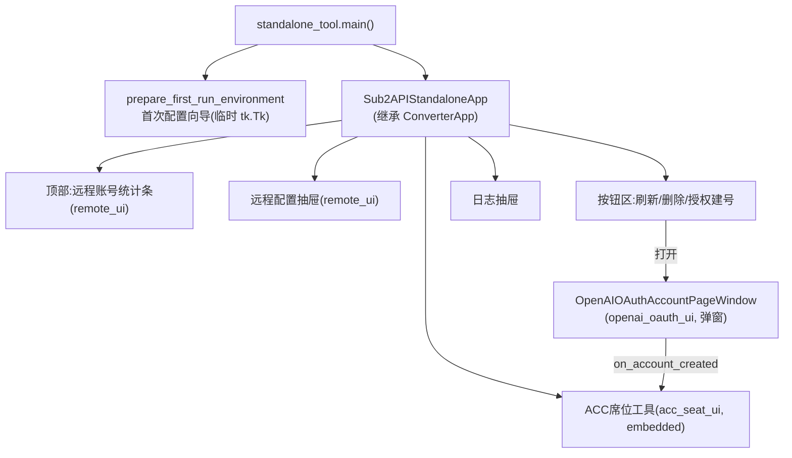
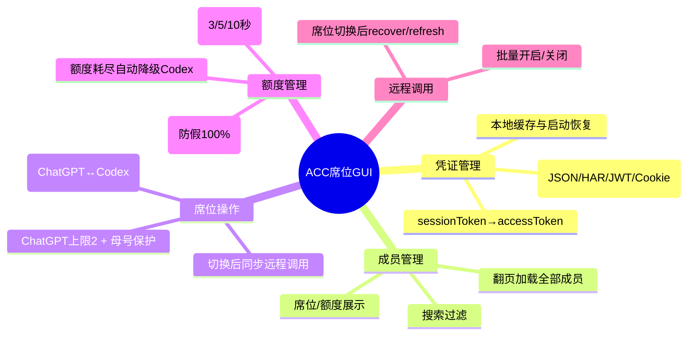
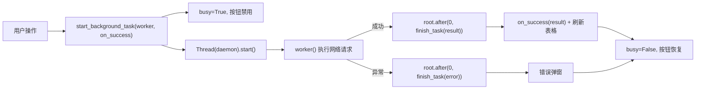
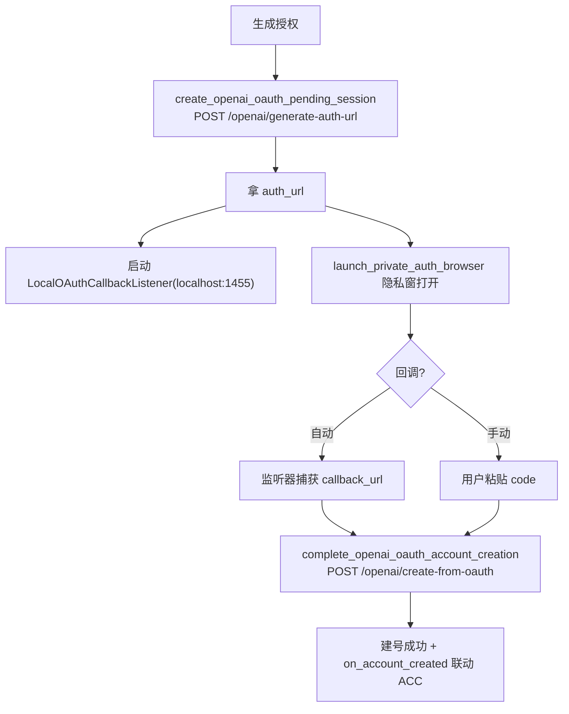
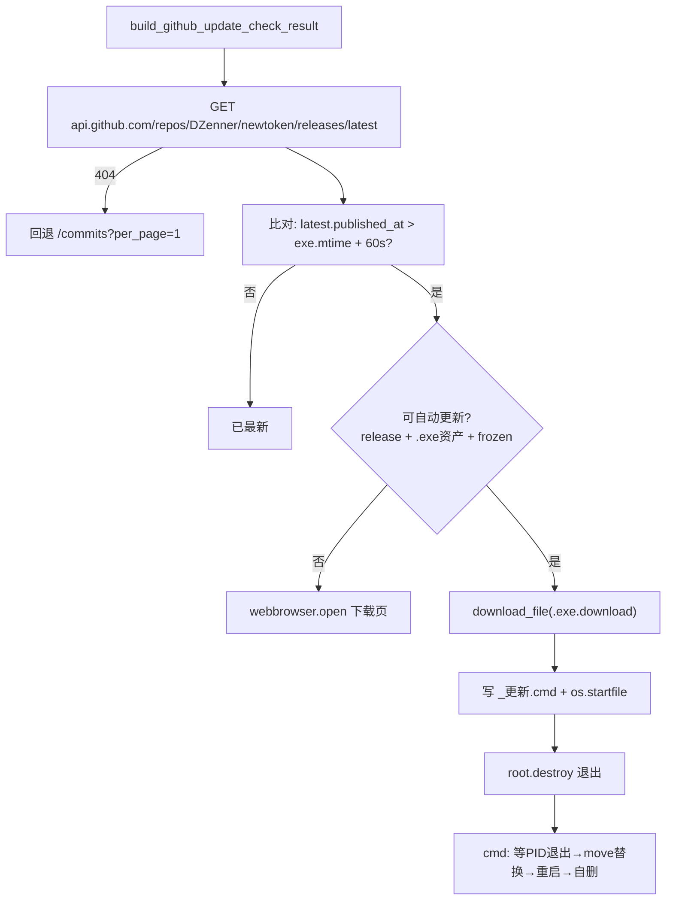

# 09 · 模块详解 · desktop 桌面端

`newtoken/desktop/`（9 个文件，~7900 行）是 tkinter 图形界面，用于 Windows 本地手动运维。与 WebUI 共用 `acc/`、`sub2api/`、`common/` 能力层，区别只在交互层。可用 PyInstaller 打包成单 exe。

| 文件 | 行数 | 职责 |
|------|------|------|
| `acc_seat_ui.py` | 3426 | 席位管理 GUI（最大文件） |
| `remote_ui.py` | 1082 | 远程操作 Mixin |
| `converter_app.py` | 936 | 主窗口（转换 + 远程管理） |
| `openai_oauth_ui.py` | 720 | OAuth 建号 GUI |
| `github_updater.py` | 431 | GitHub 自动更新 |
| `first_run_setup.py` | 427 | 首次运行配置向导 |
| `gpt_space_manager_ui.py` | 420 | 组织成员 GUI |
| `standalone_tool.py` | 123 | 桌面主入口/打包入口 |

---

## 1. 桌面端导航关系

`Sub2APIStandaloneApp` 是精简版（关闭了邮件预览、本地转换区、通用席位工具），主体是嵌入的 ACC 席位工具 + 远程管理 + OAuth 建号。OAuth 建号成功会通过 `on_account_created` 回调联动 ACC 席位管理（自动停用新号调用）。

---

## 2. standalone_tool.py —— 桌面主入口

- `main()`：调 `prepare_first_run_environment(__file__)`（除非 `SUB2API_SKIP_FIRST_RUN_SETUP=1`）→ 运行 `Sub2APIStandaloneApp().run()`。异常时写 `startup_error.log` + `MessageBoxW` 弹窗（Windows）再 re-raise。
- `Sub2APIStandaloneApp(ConverterApp)`：父类参数关闭多个面板，追加 `StandaloneAccSeatConverterApp(embedded=True)`，覆盖 `open_openai_oauth_page` 传入 ACC 联动回调。
- 启动时 `chdir_to_app_dir` + `ensure_on_sys_path`（frozen 兼容）。

---

## 3. converter_app.py —— 主窗口与基础组件

### 3.1 可复用组件

- `DrawerSection` / `DrawerState`：可折叠抽屉面板（`▼/▶` 切换），桌面端大量使用。
- `LogHandler`：线程安全日志——通过 `text_widget.after(0, ...)` 把写操作转发到主线程（tkinter 非线程安全）。

### 3.2 ConverterApp 主类

- 消息队列模型：后台线程 `put` 消息，主线程 `poll_queue()` 每 **100ms** 处理（`scan`/`progress`/`done`/`remote_done`/`remote_error`/`extract_done` 等类型）。
- 本地转换：`start_convert` → `_run_convert`（`ThreadPoolExecutor(MAX_CONCURRENT_CHECKS)` 并发 `validate_account_candidate`）→ `finish_with_summary`（按 output_mode 生成 CAP/Sub JSON）。
- 懒加载子模块（`importlib`）：邮件预览、HAR 席位工具、OAuth 窗口——避免缺依赖时崩溃。
- 继承 `RemoteUIActionsMixin` 获得远程管理能力。

---

## 4. remote_ui.py —— 远程操作 Mixin

`RemoteUIActionsMixin` 封装所有与 Sub2API/GitHub 交互的 GUI 逻辑，被 `ConverterApp` 继承。统一模式：`start_XXX()` → `set_running(True)` → `Thread(_run_XXX)` → `queue.put(("remote_done"/"remote_error", action, result))`。

| start 方法 | 底层函数 |
|-----------|----------|
| `start_remote_scan` | `scan_remote_accounts` |
| `start_remote_import` | `import_to_sub2api_codex_session` |
| `start_delete_dead/auth_error/no_quota_remote_accounts` | `delete_dead_remote_accounts` |
| `start_set_all_remote_account_privacy` | `set_all_remote_openai_account_privacy` |
| `start_check/apply_github_update` | `build_github_update_check_result` / `prepare_github_update` |

顶部统计条展示：总/活/死/无额度/平均额度/今日 Token/近 2 小时 Token + QQ群/GitHub 链接。`handle_remote_done_message`（~320 行的 if-elif 链）按 action 分支处理结果与弹窗。

---

## 5. acc_seat_ui.py —— 席位管理 GUI（核心，3426 行）

桌面端最大单文件，是 ChatGPT 席位管理的完整图形界面。主类 `StandaloneAccSeatConverterApp` 支持独立窗口或嵌入模式。

> 它通过 `newtoken.acc.seat_client`（**accounts API**，非 organizations）操作席位，并用 `sub2api.usage_bridge` 读/控远程额度状态。

### 5.1 功能地图

### 5.2 关键设计

- **本地缓存**：原文输入、成员列表、额度快照、UI 设置分别落盘（见 [06](./06-模块详解-acc席位管理.md) cache 节）。启动时自动恢复。
- **席位切换三重校验**：本地预检（母号保护 + ChatGPT 上限）→ 远端实时复查上限 → `core.ensure_user_seat`（带重试 + 进度回调）。切换后立即 `recover→refresh→enable/disable` 同步 Sub2API 调用状态。
- **自动降级策略** `execute_auto_seat_policy`：每次额度刷新后，对 5h 或 7d 耗尽的 ChatGPT 成员自动降为 Codex + 停用远程调用。**禁止自动升回 ChatGPT**（`should_promote_user_to_chatgpt` 恒 False，相关补位/冷却代码为残留死代码）。
- **Codex 可信额度缓存** `merge_trusted_usage_lookup`：Codex 账号停用后 Sub2API 会返回假 100%，用本地可信缓存覆盖防误判（字段级 `dataclasses.replace` 合并，逻辑复杂）。
- **母号保护**：读 `ACC_MOTHER_ACCOUNT_EMAIL`，母号不允许设为 ChatGPT，表格红色标注，首次检测到母号为 ChatGPT 时弹提醒。

### 5.3 后台线程框架

所有跨线程 GUI 更新都经 `root.after(0, ...)` 回主线程（tkinter 单线程模型）。

---

## 6. openai_oauth_ui.py —— OAuth 建号 GUI

`OpenAIOAuthAccountPanel` 封装完整 OAuth 建号交互：

防重入用 `_auth_completion_running`；资源（代理/分组）从 Sub2API 拉取并按 .env 默认值预选。`OpenAIOAuthAccountPageWindow` 是其 Toplevel 容器。

---

## 7. gpt_space_manager_ui.py —— 组织成员 GUI

基于 `acc.gpt_space_manager`（**organizations API + session cookie**）。`StandaloneGptSpaceManagerPanel`：加载 HAR 提取 session → 拉成员列表（Treeview）→ 手动/随机邮箱批量拉人（`add_team_member`，默认席位 `codex`）。随机邮箱用内置 50 名 + 47 姓生成。批量拉人单线程串行。

---

## 8. github_updater.py —— GitHub 自动更新（Windows）

- `DEFAULT_GITHUB_REPO = "DZenner/newtoken"`（可被 `SUB2API_GITHUB_REPO` 覆盖）。
- 版本比对用**文件修改时间**（无语义版本号），60 秒宽限防时钟偏差。
- 自动更新仅在 frozen exe 模式可用（源码模式只检查）；下载经 `common.http_client.download_file`（代理感知）。
- `.cmd` 脚本经典热更新：等父进程 PID 退出 → `move /Y` 替换 → `start` 重启 → `del` 自删。**Windows 专用**（`os.startfile`/`MessageBoxW`）。

---

## 9. first_run_setup.py —— 首次运行配置向导

- `ENV_FIELD_ORDER`（22 个键，三段）：远程 Sub2API 配置 + OAuth 建号默认 + 其他本地配置（端口/host/secret/母号邮箱/随机域名）。
- `prepare_first_run_environment`：`ensure_env_file_exists` → 若已有 `REQUIRED_ENV_KEYS`（`SUB2API_BASE_URL` + `SUB2API_ADMIN_API_KEY`）则跳过向导直接注入环境；否则弹 `FirstRunSetupDialog`（模态）收集 11 个字段，写 `.env` + 注入 `os.environ`。
- `.env` 值用 `json.dumps(ensure_ascii=False)` 序列化。`bring_window_to_front` / `center_window` 是通用窗口工具（被多处复用）。

---

## 10. 坑点

1. 自动更新链路（`os.startfile`/`MessageBoxW`）**Windows 专用**，Linux/macOS 不可用。
2. `.cmd` 脚本 UTF-8 写入但路径含中文（`Sub2API独立工具`），GBK 系统可能乱码导致替换失败。
3. `handle_remote_done_message` 单函数 ~320 行 if-elif，维护成本高。
4. acc_seat_ui 中补位升回 ChatGPT 的代码全是死代码（`should_promote_user_to_chatgpt` 恒 False）；"禁改 ChatGPT"按钮永久禁用。
5. 全量表格重绘（不保留滚动位置）；批量拉人单线程串行，数量大时界面卡顿。
6. `.env` 路径双写（STANDALONE_DIR vs PROJECT_DIR），混用需注意。
7. `merge_trusted_usage_lookup` 字段级合并逻辑复杂，难维护。

---

## 小结

- 桌面端是 WebUI 的"手动运维"孪生：共用能力层，tkinter 交互。
- `standalone_tool` 入口 → `ConverterApp`（消息队列 + 抽屉 + 远程 Mixin）→ 嵌入 `acc_seat_ui` 席位管理 + OAuth 建号弹窗。
- acc_seat_ui 走 accounts API，含自动降级、Codex 可信缓存、母号保护。
- github_updater 是 Windows 专用热更新；first_run_setup 是首次配置向导。

下一篇：[10-配置与环境变量](./10-配置与环境变量.md)。
