# 12 · 运行时序图汇总

本文集中呈现项目的关键运行时序图、状态图与流程图，便于整体把握系统动态行为。各图的详细文字说明见对应模块文档。

---

## 1. 进程线程模型

WebUI 启动后并存三类线程，职责分离：

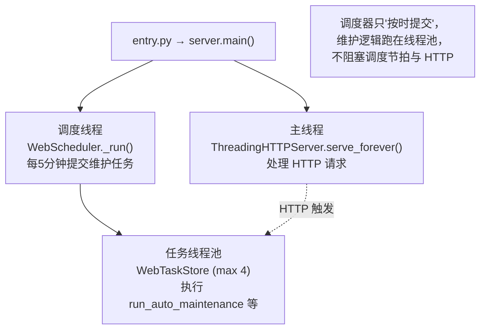

---

## 2. HTTP 请求处理与认证

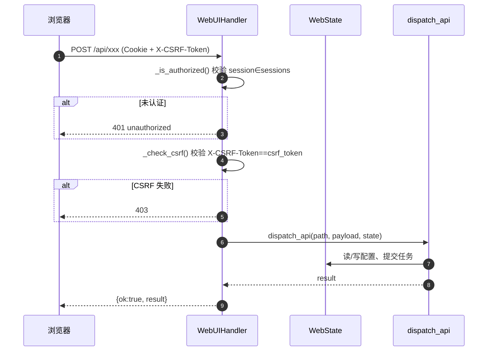

登录：`POST /login` 校验 `password==auth_secret` → 生成 session_id 写入 `sessions` → 下发 `Set-Cookie: sub2api_web_session=...; HttpOnly; SameSite=Lax`。

---

## 3. 端到端运营全景（核心）

从进程启动到一轮完整发卡的全链路：

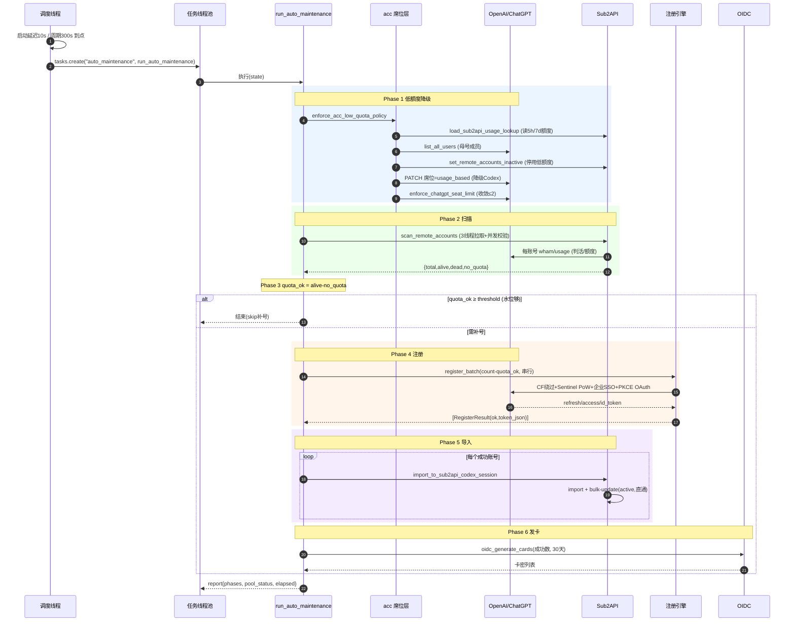

---

## 4. 调度器主循环

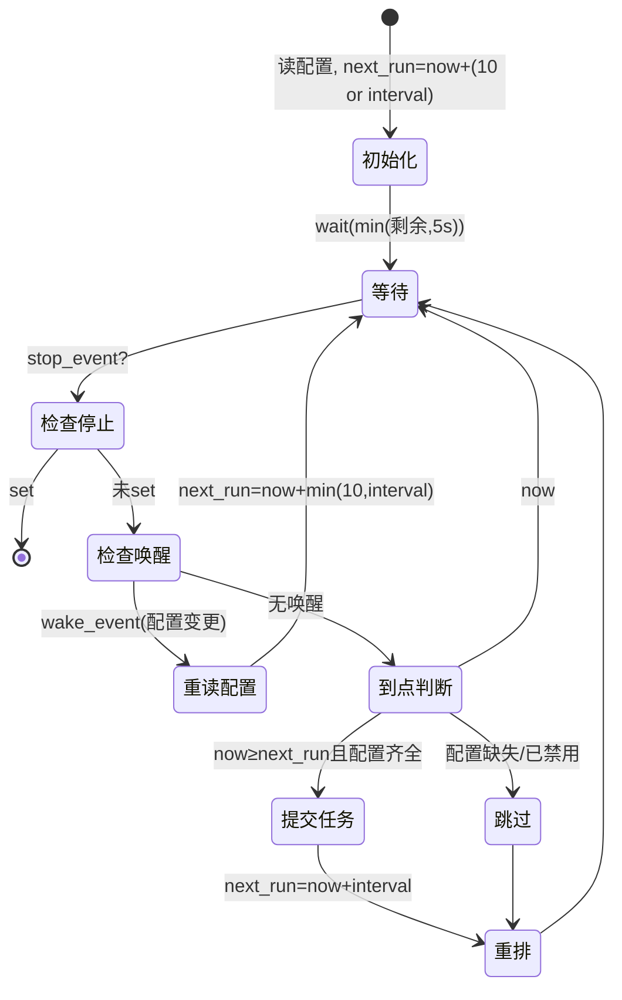

---

## 5. 自动注册单账号时序

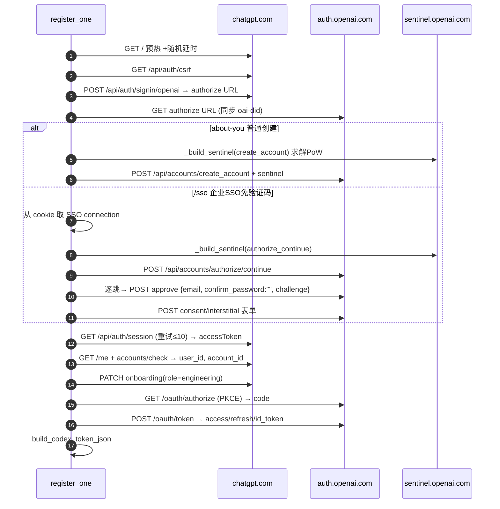

---

## 6. Sub2API 导入两分支

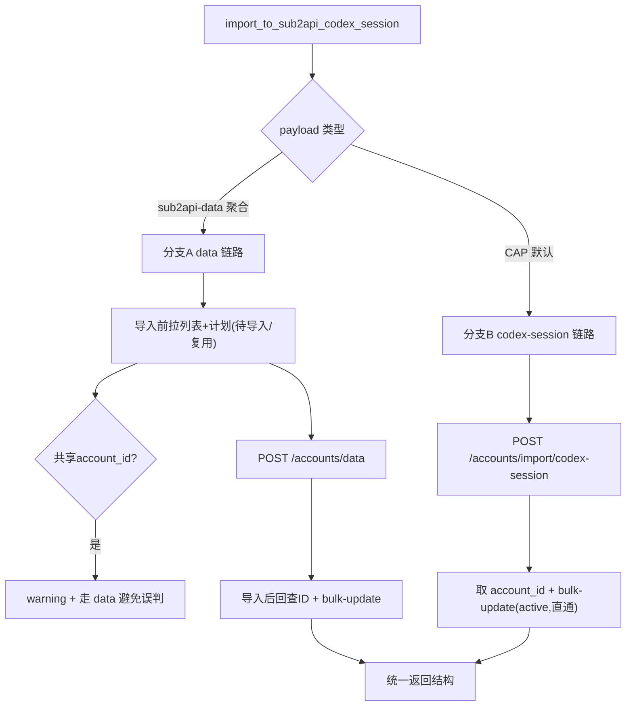

---

## 7. OAuth 远程建号两阶段

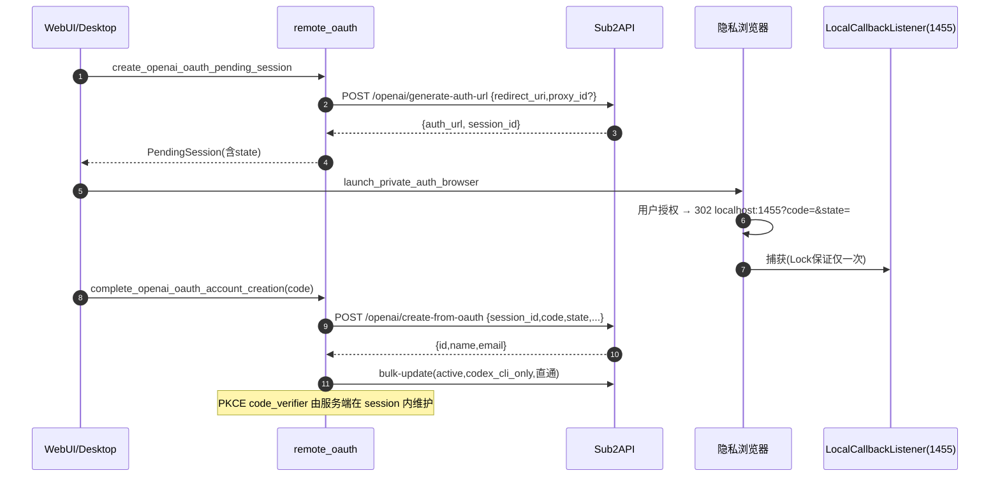

---

## 8. 席位状态机

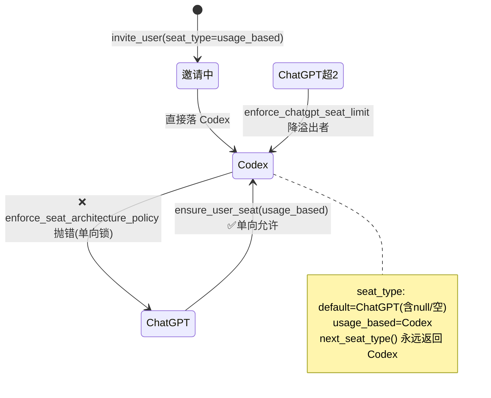

---

## 9. 账号资源生命周期

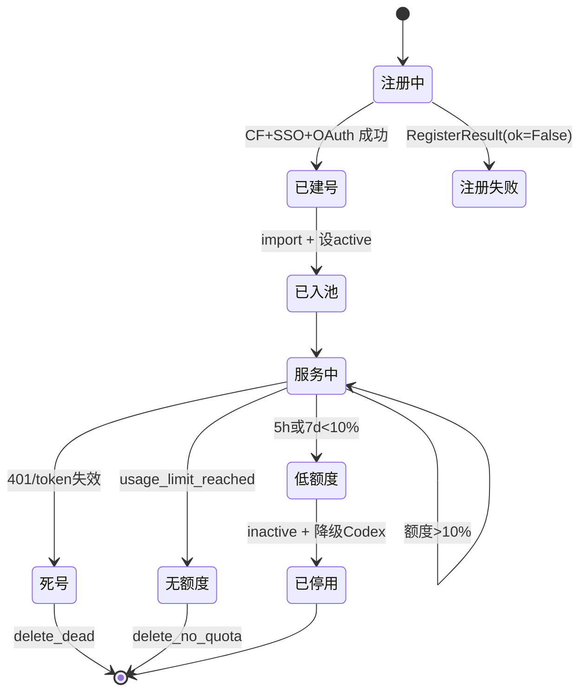

---

## 10. token 转换流水线

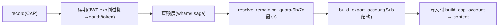

---

## 11. SOCKS5 握手（http_client 手写）

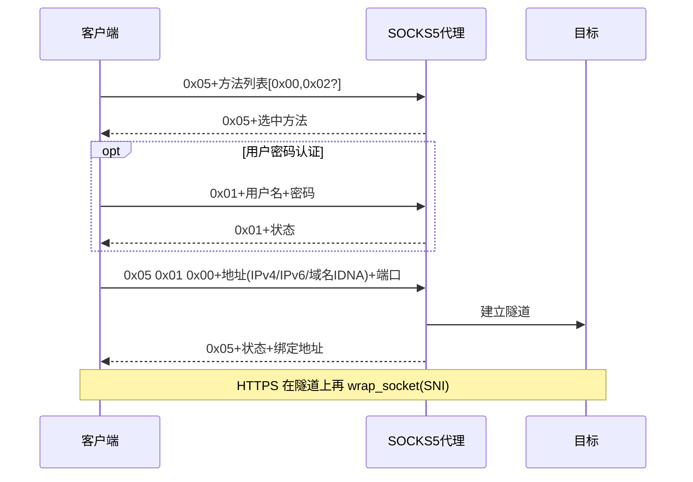

---

## 12. 桌面端后台任务框架

```mermaid
flowchart LR
    UI["用户操作"] --> ST["start_background_task"]
    ST --> BUSY["busy=True 禁用按钮"]
    ST --> TH["daemon Thread"]
    TH --> WK["worker() 网络请求"]
    WK -->|成功| OK["root.after(0, on_success)"]
    WK -->|异常| ER["root.after(0, 错误弹窗)"]
    OK --> FIN["busy=False 恢复按钮"]
    ER --> FIN
    Note over TH,FIN: 跨线程 GUI 更新一律 root.after 回主线程
```

---

## 图索引

| 图 | 详细说明所在文档 |
|----|------------------|
| 整体分层 / 组件交互 / 部署拓扑 | [01-架构总览](./01-架构总览.md) |
| 账号生命周期 / 业务闭环 / 数据流转 | [02-业务理解](./02-业务理解与核心概念.md) |
| 多阶段流水线 / 调度循环 / 任务状态机 / 降级流程 | [03-自动维护流水线](./03-自动维护流水线.md) |
| 注册流程 / Sentinel PoW / 批量并发 | [04-自动注册引擎](./04-自动注册引擎.md) |
| SOCKS5 握手 | [05-common](./05-模块详解-common基础设施.md) |
| 席位状态机 / 席位生命周期 / 两条铁律 | [06-acc](./06-模块详解-acc席位管理.md) |
| 扫描 / 导入两分支 / OAuth 两阶段 / token 转换 | [07-sub2api](./07-模块详解-sub2api对接.md) |
| HTTP 请求 / WebState 状态 | [08-webui](./08-模块详解-webui服务.md) |
| 桌面导航 / 自动更新 / 后台任务 | [09-desktop](./09-模块详解-desktop桌面端.md) |

下一篇：[13-已知问题与维护要点](./13-已知问题与维护要点.md)。
