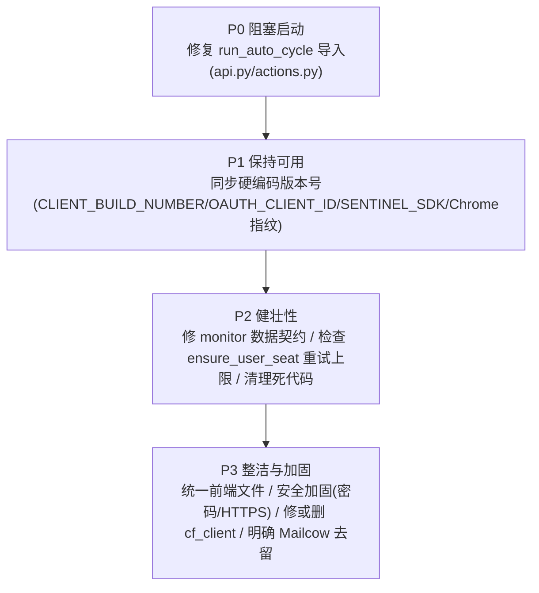

# 13 · 已知问题与维护要点

本文汇总代码分析中发现的真实 Bug、死代码、硬编码失效点、安全风险与维护清单。标注 ✅ 的为**已亲自核实源码确认**，标注 ⚠️ 的为**代码分析推断、建议复核**。

> **`feat/javoo` 更新（2026-06-17）**：合入 `origin/main` 策略层 + 重建自动补号模型。
> 1. ✅ **自动补号按"服务号水位"重建**（`auto.py`）：删除"ChatGPT 席位数 ≥ K"错误护栏（存在幽灵席位时会令其永久卡死不补号）；新增**幽灵席位清理**（占着 ChatGPT 席位却不在 Sub2API 服务池的成员先降 Codex，释放被占满的硬上限）；补号触发改为 `need = K − 池内 active ChatGPT 服务号数`，先降后补（demote-first）。
> 2. ✅ **合入策略可观测性**：`event_log.py` / `notifications.py`（PushPlus 去重告警）/ `policy_runner.py` / `/api/policy/events`。
> 3. ✅ **安装标记修复**：`SUB2API_SETUP_DONE` 配置齐全却为 false 导致卡"未安装"。
> 4. 🔴 **约束④订正**：首次 codex oauth 的 rt 是**概率性**短命（**非"一号一次性"**）——部分号运行 ~20 次后报 401、部分号首个 rt 长期可用；401 号续命见下方"待实现（P0）"。

> **`feat/javoo` 更新（2026-06-16，commit `8a65f20`）**：
> 1. ✅ **`run_auto_cycle` 启动崩溃已修复**（本文第 1 节）。
> 2. ✅ **自动注册链路已重写**：从已废弃的「企业 SSO 免验证码（`team.edu.sixoner.com`/authentik）」改为 **直接 codex oauth + 自建 OIDC 卡密 SSO**（免手机验证拿 codex token）。第 6/7 节涉及旧流程的部分已不适用，以 [14-部署运行手册](./14-部署运行手册.md) 为准。
> 3. 🔴 **新增关键约束**（违反则注册必败）：① 注册域名必须是母号绑定 Custom OIDC 的域名；② 代理用 `socks5h://`（CF 后端本地 DNS 会 TLS reset，`register.py` 已自动升级）；③ 全程直接 codex oauth、不碰 chatgpt 网页，否则触发手机验证；④ 首次 codex oauth 的 rt **概率性**短命（部分号运行 ~20 次后报 401，**非每号都会**），续命需二次 codex oauth 并概率触发 add-phone（详见下方"待实现（P0）：401 号续命"）；⑤ 账号「清理/降级」一律改席位为 Codex，**永不 remove member**。
> 4. ⚠️ ACC `seat_client` 调用也偶发 Connection reset（与注册代理同源），`ensure_user_seat` 无重试，建议比照 `register.py` 加 socks5h + 重试。

---

## 🔴 待实现（P0）：401 号二次 oauth 续命（当前为一次性消耗模式）

**现象（已实测）：** 部分注册号在 Sub2API 池内运行约 **20 次调用**后报 **401 / token_invalidated**（**概率性**，非每号都会；部分号首个 rt 可长期使用）。本质是首次 codex oauth 拿到的 rt 概率性短命，并非账号本身损坏。

**已排除：IP 不一致不是主因（2026-06-17 实测）。** 曾假设 401 源于号被 Sub2API 调用的出口 IP 与注册 IP 不一致，遂给导入号绑母号同代理（`SUB2API_PROXY_ID=33` = 注册同一 socks5 `k.y34.net`）。期间发现并修了一个**真 bug（commit `f0398ec`）**：走 `/accounts/data` 导入时 proxy_id 不在导入体内生效（`ImportData` 不读该字段），须随 `group_ids` 一起进 post-import bulk-update payload——`build_openai_post_import_update_payload` 原先漏了 proxy_id（`/accounts/bulk-update` 端点字段级收 proxy_id）。绑定生效后（`GET /accounts/9748 → proxy_id=33` 落库确认），**8 分钟观察号仍大量 401（含已绑 33 的号）、active 仍波动**——即 **IP 一致未消除 401，根因回到 rt 概率性短命**。绑同代理仍是对的基础设施（保留），但不是 401 的解药；续命（下文）仍是正解。

**当前行为（消耗模式）：** `enforce_acc_low_quota_policy` 的 `delete_invalidated_accounts` 直接删除 401 号（ACC 成员 + Sub2API 账号），下一轮 `auto.py` 再注册新号补位。**问题**：每个 401 号被丢弃重建，高频消耗卡密与 OpenAI 账号/席位，且补出的新号同样可能 20 次后 401，形成"注册 → 跑 → 401 删 → 再注册"的烧号循环，不是稳定运行。

**应有行为（续命）：** 401 号应优先做**第二次 codex oauth 登录**拿新 rt、更新 Sub2API 池内凭证继续跑，**真正失败才删**。复用同一 OpenAI 账号与席位，避免重建。

**命门：add-phone。** 第二次 codex oauth 会**概率性**要求 add-phone（手机验证），`register.py` 当前未处理该页（参考实现日志可见 `unhandled_page:auth.openai.com/add-phone`）。续命链路落地前必须先确定 add-phone 的处理方式（接码平台 / 现成 API / 其它），再在注册引擎补"add-phone 验证"分支。

**落地步骤（待定，依赖 add-phone 方案）：**
1. `register.py` 增加"对已存在账号的二次 codex oauth"入口（含 add-phone 处理分支）。
2. `enforce` / `auto` 把 401 处置从"直接删除"改为"先续命、失败再删"。
3. 续命成功后更新 Sub2API 账号 credential（新 rt），保持 active。

---

## 1. ✅ 已修复（feat/javoo `8a65f20`）：`run_auto_cycle` 导入错误（曾阻塞 WebUI 启动）

> 已修复：删除 `api.py` 的死引用与不可达分支、`actions.py` shim 收敛到 `run_auto_maintenance`、并去掉已删的 `refresh_acc_usage` 残留。下文保留原始问题记录备查。

✅ **已确认**（修复前）。`webui/auto.py` 只定义了 `run_auto_maintenance`，**不存在** `run_auto_cycle`，但有两处引用它：

```python
# webui/api.py:22
from newtoken.webui.auto import run_auto_cycle          # ← ImportError
# webui/api.py:257
return state.tasks.create(action, run_auto_cycle, state) # ← 不可达(见下)

# webui/actions.py:20
from newtoken.webui.auto import run_auto_cycle          # ← ImportError
# webui/actions.py:47  __all__ 里也列了 "run_auto_cycle"
```

**后果**：`api.py` 在模块导入阶段即抛 `ImportError` → `server.py`（`from newtoken.webui.api import dispatch_api`）导入失败 → **整个 WebUI 无法启动**。

**根因**：`5b4a70a refactor: unified maintenance cycle` 重构把 `run_auto_cycle` 统一改名为 `run_auto_maintenance`，但漏改了 `api.py` 和 `actions.py` 的引用。

**修复方案**（三处）：
1. `api.py:22` 和 `actions.py:20`：`run_auto_cycle` → 删除该 import 或改为 `run_auto_maintenance`（注意 api.py:236 已有函数内延迟导入 `run_auto_maintenance`）。
2. `api.py:257`：把 `run_auto_cycle` 改为 `run_auto_maintenance`（或删除整个不可达分支，见第 3 节）。
3. `actions.py:47` 的 `__all__`：移除 `"run_auto_cycle"`。

---

## 2. ⚠️ `cf_client.py` 孤立模块 + `cf_request_json` 参数 Bug

✅ **已确认**：`cf_client.py` 在 `newtoken/` 包内**无任何引用方**（孤立模块）。真正的 CF 绕过在 `register.py` 内联实现。

✅ **已确认 Bug**（`cf_client.py:82`）：
```python
resp = getattr(session, method.lower())(
    "get" if method.upper()=="GET" else method.lower(),  # ← 方法名被当成URL(第一个位置参数)
    url, **kwargs)
```
正确应为 `session.request(method.upper(), url, **kwargs)`（如 `cf_request_text:124`）。

**影响**：因模块孤立、`cf_request_json` 仅被同样无外部调用的 `cf_test` 使用，该 Bug **当前不影响任何运行路径**。但若未来启用 cf_client，**必须先修复**。优先级 P3。

---

## 3. ⚠️ 死代码清单

| 位置 | 死代码 | 来源 |
|------|--------|------|
| `api.py` / `start_named_task` | `action=="auto_maintenance"` 被前面 `AUTO_MAINTENANCE_TASK_LABEL`（值同为 `"auto_maintenance"`）分支提前拦截，第二个分支（`run_auto_cycle`）永不可达 | ⚠️ 分析 |
| `desktop/acc_seat_ui.py` | `should_promote_user_to_chatgpt` 恒返回 False，整套"补位升回 ChatGPT"的探测/冷却代码永不执行；"禁改 ChatGPT"按钮永久 DISABLED | ⚠️ 分析 |
| `webui/acc.py` `normalize_unknown_seats` | `return` 之后的代码块永不执行 | ⚠️ 分析 |
| `register.py` `_generate_password` | 定义但未调用（SSO 流不需密码） | ✅ 确认逻辑 |

建议：清理死代码或恢复其调用（取决于产品意图，如是否要恢复"升回 ChatGPT"功能）。

---

## 4. ⚠️ 前端双份文件（易改错）

✅ **已确认**：当前页面只用 `page.py` + `assets.py`。以下 5 个前端文件**无任何引用、是未接线残留**，且内容已与 assets.py 漂移：

- `assets_js.py`、`assets_css.py`、`assets_oauth_js.py`、`assets_acc_js.py`、`page_oauth_html.py`

这些残留保留了**当前主页缺失的功能**（OAuth 一步建号入口、自动注册按钮、维护健康度展示）。维护时极易改错文件。

建议：要么删除残留，要么明确把它们接线回页面（如需恢复 OAuth/自动注册的前端入口）。

---

## 5. ⚠️ 数据契约不一致：`monitor.evaluate_health`

`webui/monitor.py` 的 `evaluate_health` 期望输入 `{"items":[...]}`，但 `scan_remote_accounts` 实际返回 `{"dead_items","no_quota_items",...}`（无统一 `items` 键，也无 `alive_items`）。两者直接对接会失效。`monitor.py` 整体似乎是早期/未完全接通的产物（`auto_offline_dead` 也忽略传入 target、固定按 dead 删）。

建议：确认 `monitor.py` 是否仍需要；若需要，统一其与 `scan_remote_accounts` 的数据契约。

---

## 6. 🟠 P1 硬编码失效点（反检测维护核心）

下列值与 OpenAI 当前实现强绑定，OpenAI 改版即需同步更新，否则注册/席位操作会失败或触发风控：

| 值 | 位置 | 风险 | 维护方式 |
|----|------|------|----------|
| `OAUTH_CLIENT_ID = app_EMoamEEZ73f0CkXaXp7hrann` | register.py / converter_core.py | Codex CLI client_id 变更 → OAuth 失败 | 跟随 Codex CLI 更新 |
| `SENTINEL_SDK = 20260124ceb8` | register.py | Sentinel SDK 版本过期 → PoW 被拒 | 抓包更新 |
| `_fnv1a_32` 三个乘数常量 | register.py | Sentinel 算法变更 → PoW 失效 | 逆向更新 |
| `POW_ERROR_PREFIX` | register.py | 兜底 token 格式 | — |
| FingerprintProfile Chrome 131/142 | register.py | 版本过旧易被识别 | 定期升版 |
| `CLIENT_BUILD_NUMBER = 7295677` | seat_client.py | 前端版本号过期 → 席位接口风控 | 跟随 ChatGPT 前端 |
| `CLIENT_VERSION = prod-6fad...` | seat_client.py | 同上 | 同上 |
| `_complete_external_sso_flow` 表单字段名 | register.py | SSO 页面改版 → 解析失败 | 跟随 OpenAI SSO 页 |

> 这些是项目长期运行的主要维护负担。建议建立"OpenAI 改版监控 → 同步更新"的运维流程。

---

## 7. ⚠️ Mailcow 配置未使用

✅ **已确认**：`MAILCOW_*`（12 项）/ IMAP 配置仅在 `acc/local_env.py` 的 `ENV_KEY_ORDER` 中定义，**无任何模块读取**。

它"设计上"支持 Mailcow 自建邮件系统批量建邮箱 + IMAP 收 OpenAI 验证邮件（即"邮箱+验证码"注册路径），但**当前生效的 `register.py` 走企业 SSO 免验证码**，不使用这些字段。

**业务张力提示**：这暗示项目曾有/计划有一条"普通邮箱+验证码"的注册路径（需 Mailcow + IMAP 收码），但当前实现完全依赖企业 SSO 域名。若企业 SSO 域名失效，需重新接入 Mailcow 路径。建议明确 Mailcow 配置的去留。

---

## 8. 🟠 安全风险清单

| 风险 | 说明 | 建议 |
|------|------|------|
| **空密码免登录** | `SUB2API_WEB_SECRET` 为空时 `_is_authorized` 直接放行，公网部署等于无防护 | 强制设置强密码 |
| **Cookie 无 Secure** | 默认 HTTP 部署，session cookie 仅 `HttpOnly`+`SameSite=Lax`，无 `Secure` | 用 HTTPS 反代并加 Secure |
| **OAuth 回调 HTTP 明文** | `oauth_callback_html` 硬编码 `http://{host}{path}` | 反代 HTTPS + 正确设 `SUB2API_WEB_PUBLIC_BASE_URL` |
| `redact_config` 不删原值 | 只追加 `_MASKED` 字段，原始敏感值仍在响应里 | 前端必须用 MASKED 版本，或改为替换原值 |
| `apply_proxy_env` 全局副作用 | 修改进程级环境变量，多线程并发配置更新有竞态 | 注意并发；`load_config` 高频调用会反复执行 |
| `cf_client._session` 非线程安全 | 模块级单例无锁（但孤立不影响） | 启用前加锁 |
| 凭据明文落 `.env` | access/session token 明文存储 | 限制文件权限 |

---

## 9. ⚠️ 待核实疑点

| 疑点 | 状态 |
|------|------|
| `cf_request_json` getattr bug 是否影响任何启用路径 | ✅ 不影响（cf_client 孤立） |
| Mailcow 配置是否计划启用 | ⚠️ 待产品确认 |
| `monitor.evaluate_health` 与 scan 结构不一致是否有意 | ⚠️ 待确认 |
| `select_chatgpt_overflow_users` 按列表顺序降级（无优先级）是否符合预期 | ⚠️ 待确认 |
| `ensure_user_seat(max_attempts=None)` 上层是否都传了 max_attempts | ⚠️ 需检查调用点（无限重试风险） |

---

## 10. 维护优先级排序



| 优先级 | 事项 | 影响 |
|--------|------|------|
| **P0** | 修 `run_auto_cycle` 导入 | WebUI 能否启动 |
| **P1** | 同步 OpenAI 相关硬编码 | 注册/席位能否工作、是否被风控 |
| **P1** | 强制 Web 密码 + 出站代理 | 安全 + 防封号 |
| **P2** | 检查 `ensure_user_seat` 重试上限 | 防单席位拖垮维护 |
| **P2** | 修 `monitor` 契约 / 清死代码 | 健壮性、可维护性 |
| **P3** | 统一前端文件 / 修 cf_client / Mailcow 去留 | 整洁度 |

---

## 11. 日常运维健康检查清单

- [ ] WebUI 能正常启动（P0 修复后）、`/api/tasks/list` 看板有调度器状态。
- [ ] 自动维护看板各阶段 `phase:ok`，无持续 `err`。
- [ ] 注册成功率正常（关注 `register` 阶段 ok/fail）；失败多则检查硬编码版本号/SSO 域名/代理。
- [ ] 资源池水位（`alive`/`quota_ok`）维持在阈值以上。
- [ ] 出站代理可用（`SUB2API_OUTBOUND_PROXY_URL`），避免同 IP 批量操作。
- [ ] OIDC 发卡正常（Phase 6 非持续 skipped）。
- [ ] `.env` 必填项无占位符（避免被判未配置）。
- [ ] 母号凭据未过期（access/session token）。

---

## 小结

- **最紧急**：`run_auto_cycle` 导入错误必须先修，否则 WebUI 起不来。
- **长期负担**：大量与 OpenAI 实现绑定的硬编码（版本号、client_id、Sentinel、指纹、SSO 表单），需持续跟进。
- **清理项**：孤立的 cf_client、未接线的前端残留、死代码、未用的 Mailcow 配置。
- **安全**：强制密码、HTTPS、出站代理是部署底线。

← 返回 [文档导航](./README.md)
